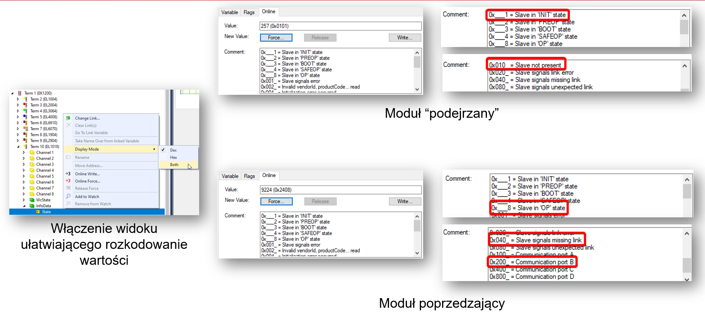
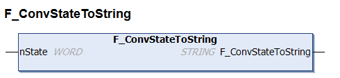
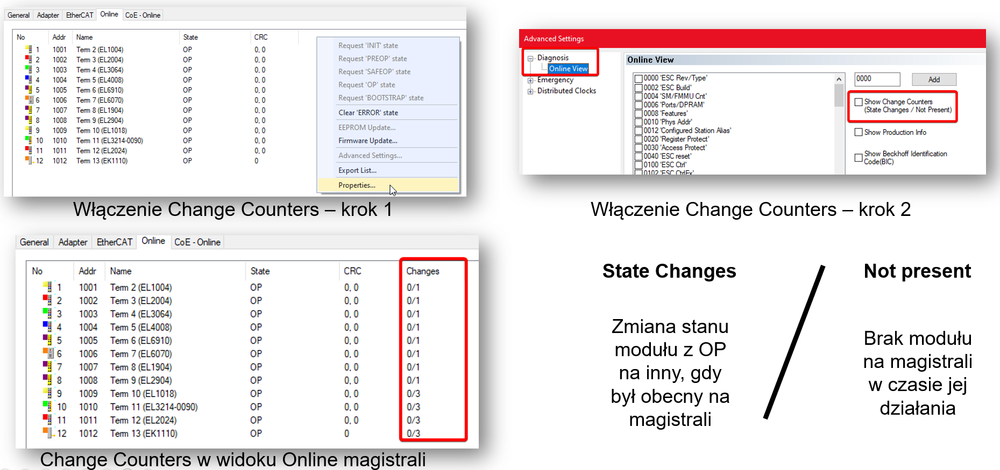

# EtherCAT Diag
{: .no_toc }
<h6> Data modyfikacji: 05.11.2025 </h6>
## Table of Contents
{: .no_toc .text-delta }

1. TOC
{:toc}

# Podstawowa diagnostyka urządzeń działający na magistrali EtherCAT

W przypadku urządzeń wyposażonych w magistralę EtherCAT (moduły EL, serwowzmacniacze serii AX itd.) diagnostyka urządzeń pod kątem komunikacji dostępna jest bezpośrednio z poziomu TwinCATa. Pozwala to na prostą i darmową diagnostykę bez konieczności wykorzystywania dodatkowych urządzeń czy oprogramowania. 

Diagnostyka składa się z kilku podstawowych elementów do sprawdzenia, które zawsze należy sprawdzić w przypadku wystąpienia jakiejkolwiek awarii w maszynie, by upewnić się, że problem jest / nie jest komunikacyjny. Zostaną one opisane w kolejnych punktach niniejszej dokumentacji.

## Stan maszyny stanów EtherCAT

Magistrala EtherCAT działa na zasadzie maszyny stanów, natomiast przejścia między stanami odbywają się po spełnieniu ściśle określonych warunków. W komunikacji EtherCAT wyróżniamy następujące stany:

### INIT

Jest to pierwszy stan po uruchomieniu urządzenia typu Slave. W tym stanie nie jest jeszcze zawiązana żadna komunikacja pomiędzy Masterem a Slavem. Master próbuje zainicjować komunikację, "zadając" urządzeniu Slave dwa "pytania": 
* Czy tam jesteś?
* Czy jesteś urządzeniem, którego w tym miejscu się spodziewam?

W ramach przypomnienia - EtherCAT działa na zasadzie ściśle określonej w pliku konfiguracyjnym topologii, stąd to drugie "pytanie" jest zasadne.

Jeżeli moduł zgłosi się, a urządzenie Master uzna, że jest to Slave, który zgadza się z plikiem konfiguracyjnym, następuje przejście do kolejnego stanu.

### PREOP (Pre-Operational)

Jest to stan, w którym Master ma już zawiązaną komunikację asynchroniczną z urządzeniem Slave. W tym stanie urządzenie Slave otrzymuje od Mastera paczkę danych konfiguracyjnych, zawartych w StartUp list urządzenia. 

Jeżeli urządzenie Slave skonfiguruje się poprawnie - czyli jest w stanie poprawnie przyjąć wszystkie ustawienia z pliku konfiguracyjnego i zgadzają się one z faktycznym stanem urządzenia (np. ustawienia dodatkowych urządzeń peryferyjnych, takich jak chociażby karta Safety dla serwowzmacniaczy AX5000), wówczas następuje zawiązanie komunikacji synchronicznej i przejście do kolejnego stanu.

### SAFEOP (Safe-Operational)

Jest to pierwszy stan, w którym pomiędzy urządzeniami Master i Slave odbywa się pełna komunikacja synchroniczna (czyli bez magistrali EtherCAT zsynchronizowanej z taskiem PLC nie uzsykamy stanów dalszych niż PREOP). Wejścia są odczytywane w sposób standardowy, jednak wyjścia wciąż pozostają w trybie bezpiecznym (stąd Safe w nazwie stanu).

Jeżeli nastąpi potwierdzenie poprawności komunikacji, urządzenie przechodzi do kolejnego stanu.

**UWAGA!!!**

**Stan ten występuje jako pożądany po potwierdzeniu poprawności konfiguracji modułów - po stanie PREOP lub też jako niepożądany w wyniku błędu np. watchdoga - powrót ze stanu OP.**

**Zawsze należy określić, czy aktualny stan SafeOP jest stanem pożądanym, czy nie.**

### OP (Operational)

Stan pożądany w zdecydowanej większości aplikacji. Oznacza on, że z urządzeniem prowadzona jest standardowa komunikacja synchroniczna (mamy również możliwość wysyłania zapytań w sposób asynchroniczny). 

Wszystkie urządzenia, które są aktualnie uruchomione w aplikacji (wykluczamy tutaj urządzenia, które są odłączone, a są skonfigurowane poprzez Sync Unit lub Hot Connent) powinny znajdować się właśnie w tym stanie. Oznacza to, że nie mają one żadnych problemów komunikacyjnych, a ewentualne problemy w aplikacji spowodowane są innymi czynnikami.

### BOOT (Bootstrap)

Tryb niewystępujący w "standardowej" maszynie stanów magistrali EtherCAT. Jest on wywoływany ręcznie po ręcznym przejściu urządzeniem Slave w tryb INIT. W trybie tym dokonywać można np. wymiany firmware w urządzeniach takich jak serwowzmacniacze AX5xxx czy AX8xxx.

Tryb ten jest swoistym "restartem" firmware, więc w niektórych przypadkach wykonanie procedury przejścia OP->INIT->BOOT->INIT->OP może pomóc przy problemach z urządzeniem. 

**Pełny opis dostępny jest [w Infosys](https://infosys.beckhoff.com/content/1033/ethercatsystem/1036980875.html)

## Odczyt zmiennej state z poziomu Process Data urządzenia

Stan magistrali EtherCAT na urządzeniu typu Slave można odczytać, korzystając ze zmiennej zaszytej w Process Data urządzenia:

Pełna lista wraz z opisem funkcji pozwalającej na rozkodowanie wartości w PLC znajduje się [Tutaj](https://infosys.beckhoff.com/content/1033/tcplclib_tc2_ethercat/57081355.html)

## Change Counters

EtherCAT jest magistralą posiadającą funkcjonalność autoresetu - czyli po wykryciu, że nie ma żadnych problemów sprzętowych samoczynnie próbuje ona wrócić do stanu OP. Ma to niewątpliwie swoje zalety, jak chociażby brak konieczności resetu ręcznego (tak, jak było to chociażby przy magistrali K-Bus), jednakże z tego powodu nie jesteśmy w stanie na pierwszy rzut oka stwierdzić, że jakiś błąd wystąpił "w międczyczasie". Z pomocą przychodzą nam wówczas tzw. Change Counters - czyli liczniki, które pozwalając podejrzeć "historię" tego, co działo się na magistrali. Dzielą się one na dwa liczniki:

* State Changes (licznik lewy) - czyli zmiana stanu modułu z OP na inny, gdy był on dostępny fizycznie na magistrali. Zmiana może być spowodowana np. problemami aplikacyjnymi (zatrzymanie wykonywania programu, przekroczenia czasu cyklu), zadziałaniem funkcji Watchdog na urządzeniu czy błędem hardware'owym urządzenia
* Not Present (licznik prawy) - czyli brak fizycznej obecności urządzenia na magistrali - może być to spowodowane np. wyłączeniem urządzenia czy przerwaniem / odłączeniem / uszkodzeniem przewodu komunikacyjnego lub też zaśniedziałymi stykami przy modułach EL i pinach magistrali znajdujących się bezpośrednio na nich

Liczniki włącza się z poziomu widoku EtherCAT -> Online:

## Emergency Scan

W niektórych przypadkach, gdy istnieje uzasadnione podejrzenie problemów komunikacyjnych wynikających z czynników zewnętrznych, takich jak warunki środowiskowe, zakłócenia EMC czy uszkodzenia przewodów poprowadzonych w miejscach trudno dostępnych, warto wykonać test tak zwanego Emergency Scan, który polega na wysłaniu do urządzenia określonej przez użytkownika liczby ramek EtherCAT, a następnie sprawdzeniu, ile z nich poprawnie powróci do urządzenia Master. Jest to swoisty tester jakości połączenia, który pozwala na sprawdzenie, czy nasza komunikacja będzie przebiegała w sposób stabilny.

Emergency Scan wywołuje się z zakladki EtherCAT -> Advanced Settings -> Emergency -> Scan:

Następnie należy wybrać ilość ramek, które chcemy przesłać i wybrać Start Scan - wynik pokaże się w oknie:

Jakikolwiek inny wynik niż 100% poprawnych ramek oznacza, że z komunikacją mogą występować problemu, co będzie prowadziło do późniejszej niestabilności aplikacji.