# EtherCAT Sync Units
<h6> Data modyfikacji: 20.12.2024 </h6>

Dokument  krok  po  kroku  prezentuje  konfigurowanie  funkcji  Sync  Units  sieci  EtherCAT dla przykładowej topologii sieci składającej się z Embedded PC CX9020 z dołączonym modułem rozszerzeń EtherCAT EK1110 oraz trzech szaf z wyspami EK1100.

## Topologia przykładowej sieci EtherCAT

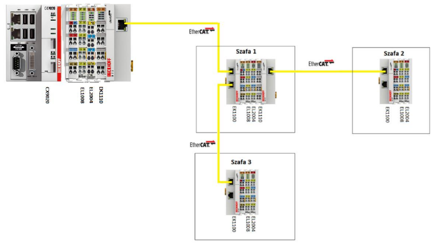

## Opis funkcjonalności

Funkcja Sync Units pozwala na prawidłową wymianę danych z częścią sieci EtherCAT w przypadku, gdy inna część tej sieci jest odłączona (czyli np. w przypadku uszkodzenia lub odłączenia szafy 2, szafa 1 i szafa 3 będą wciąż poprawnie działać).

W  przypadku,  w  którym  chcemy  dokonywać  zmian  konfiguracji  w  trybie  online,  należy skonfigurować funkcję EtherCAT HotConnect.

## Konfiguracja sieci

Topologię sieci możemy sprawdzić w zakładce Devices 1 (EtherCAT) -> EtherCAT -> Topology. W naszym przykładzie topologia wygląda następująco:

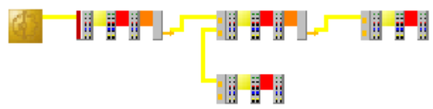

## Komendy w ramce EtherCAT

Ramka protokołu EtherCAT składa sie z różnego rodzaju komend odczytu i zapisu. Komendy te można zobaczyc w polu Cmd, na zakładce EtherCAT urządzenia EtherCAT Master. Maksymalnie ramka może się składać z 15 komend.

Poniższa tabela pokazuje podział komend ze względu na adresy:

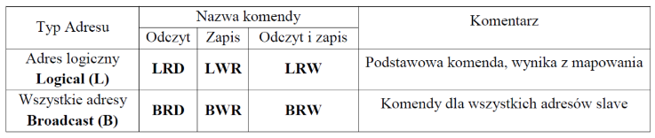

W naszym przypadku występują komendy:
1.   LWR – zapis modułów wyjść
2.   LRD – odczyt modułów wejść
3.   BRD – ogólny odczyt parametrów

## Konfiguracja 

W  naszym  wypadku  widać,  że  póki  co  funkcja  Sync  Unit  nie  została  skonfigurowana  (napis <default> w kolumnie Sync Unit na zrzucie ekranu załączonym poniżej):

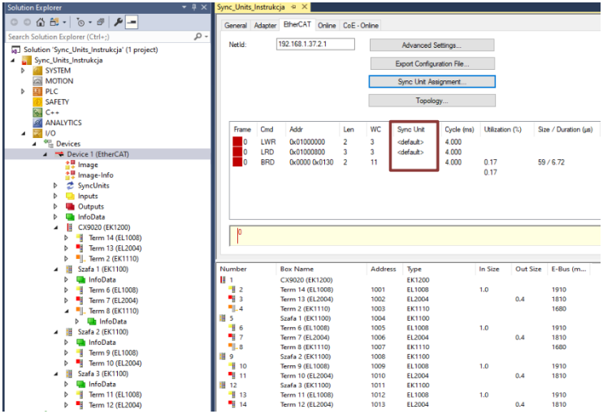

W projekcie stworzymy trzy Sync Units, po jednym dla każdej szafy. Sync Units tworzy się poprzez kliknięcie „Sync Unit Assignment” w zakładce EtherCAT mastera EtherCATowego.

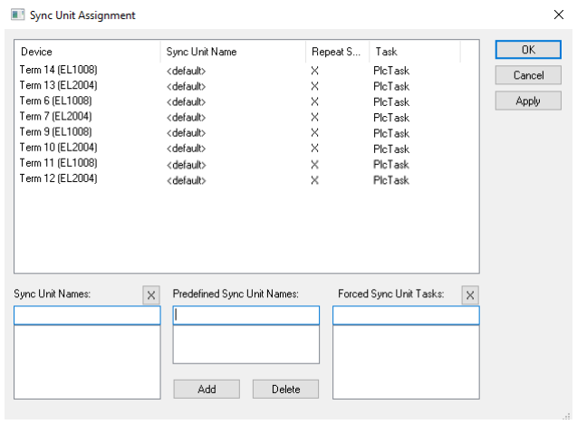

Nowy Sync Unit tworzy się poprzez zaznaczenie modułów które chcemy do niego przypisać (można zaznaczyć kilka modułów przytrzymując klawisz Ctrl), a następnie wpisując jego nazwę w polu Sync Unit Names.

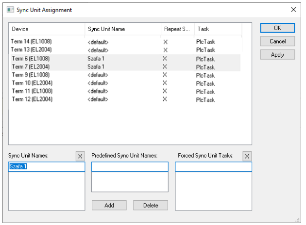

W podobny sposób tworzymy Sync Units dla pozostałych szaf. Gotowa konfiguracja powinna wyglądać    następująco    (po    przypisaniu    należy    pamiętać    o    wciśnięciu    przycisku    Apply): 

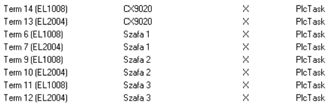

Widok zakładki EtherCAT mastera EtherCATowego po przypisaniu Sync Units:

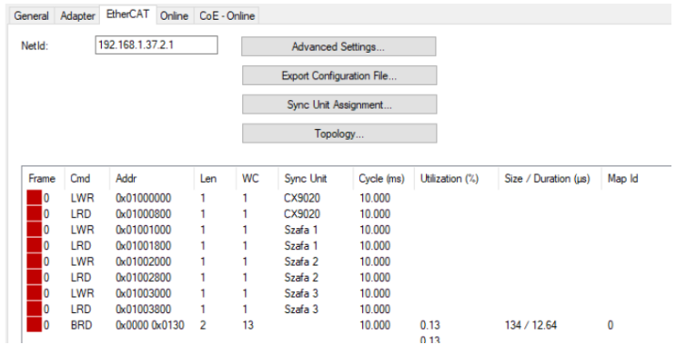

## Funkcje dodatkowe

W TwinCAT 3 dodano możliwość szybkiego przekazywania modułów pomiędzy poszczególnymi Sync Units. Dokonuje się tego w zakładce Sync Units w drzewie projektu. Po rozwinięciu otrzymujemy informacje o istniejących w projekcie Sync Units, a po wejściu w poszczególne możemy odznaczać przypisanie modułu do konkretnego Sync Unit lub przypisywać do niego moduły nieprzypisane.

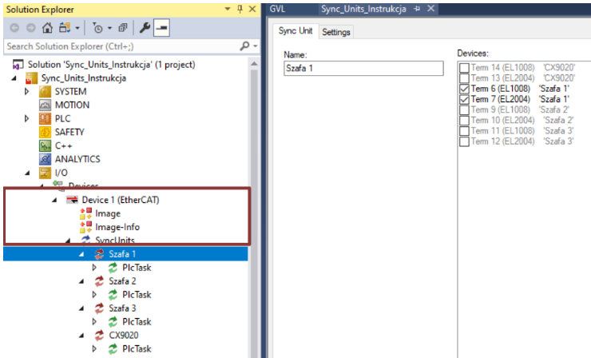

W tej zakładce można także zmienić nazwę Sync Unit. Po kliknięciu PPM na „SyncUnits” mamy także możliwość dodania Sync Unit bezpośrednio z poziomu drzewa projektu.

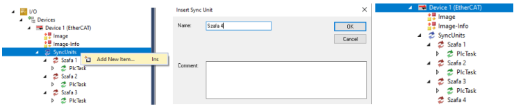

## Diagnostyka

Zmienna  Frm0WcState jest  zmienną  typu  UINT,  która  pokazuje  diagnostykę  danych  dla poszczególnych komend ramki cyklicznej EtherCAT (lista komend pokazana jest w tabeli na rysunku powyżej). Dla każdej komendy rezerwowany jest bit tej zmiennej zgodnie z listą rozkazów – numer komendy odpowiada numerowi bitu. Gdy komenda działa prawidłowo mamy w bicie wartość 0, gdy jest błąd to wartosc 1. Dzięki temu możemy łatwo zdiagnozować połączenie.

Wartość  zmiennej  Frm0WcState  równa  0  oznacza,  że  cała  sieć  EtherCAT  działa  prawidłowo, wartość różna od 0 oznacza, że gdzieś występuje problem.

W  naszym  przykładzie  odłączamy  Szafę   3.  Zmienna  Frm0WcState  przyjmie  binarnie  wartość 0000000111000000b. Oznacza to, że:

1.   Bit 0 = 0 – LWR dla CX9020 – działa zapis dla Sync Unit sterownika
2.   Bit 1 = 0 – LRD dla CX9020 – działa odczyt dla Sync Unit sterownika
3.   Bit 2 = 0 – LWR dla Sync Unit 1 – działa zapis dla Szafy 1
4.   Bit 3 = 0 – LRD dla Sync Unit 1 – działa odczyt dla Szafy 1
5.   Bit 4 = 0 – LWR dla Sync Unit 2 – działa zapis dla Szafy 2
6.   Bit 5 = 0 – LRD dla Sync Unit 2 – działa odczyt dla Szafy 2
7.   Bit 6 = 1 – LWR dla Sync Unit 3 – nie działa zapis dla Szafy 3
8.   Bit 7 = 1 – LRD dla Sync Unit 3 – nie działa odczyt dla Szafy 3
9.   Bit 8 = 1 – BRD – nie działa odczyt ze wszystkich adresów

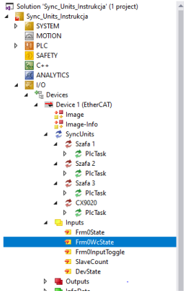

## Dodatkowe informacje

[Infosys](https://infosys.beckhoff.com/english.php?content=../content/1033/tc3_io_intro/1468206859.html)

---