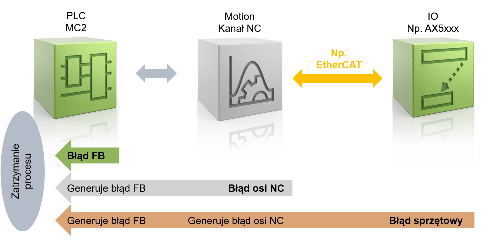
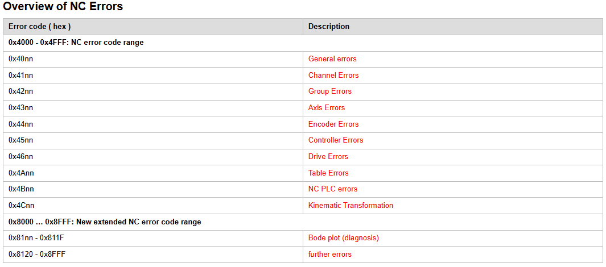
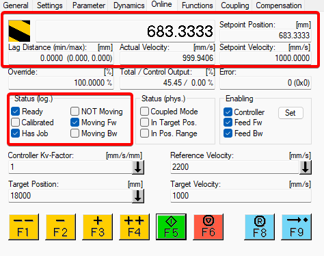
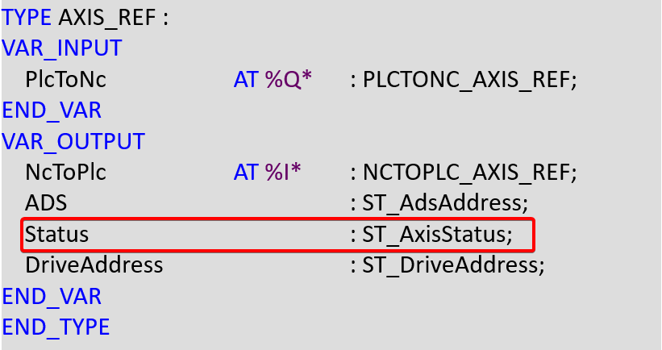
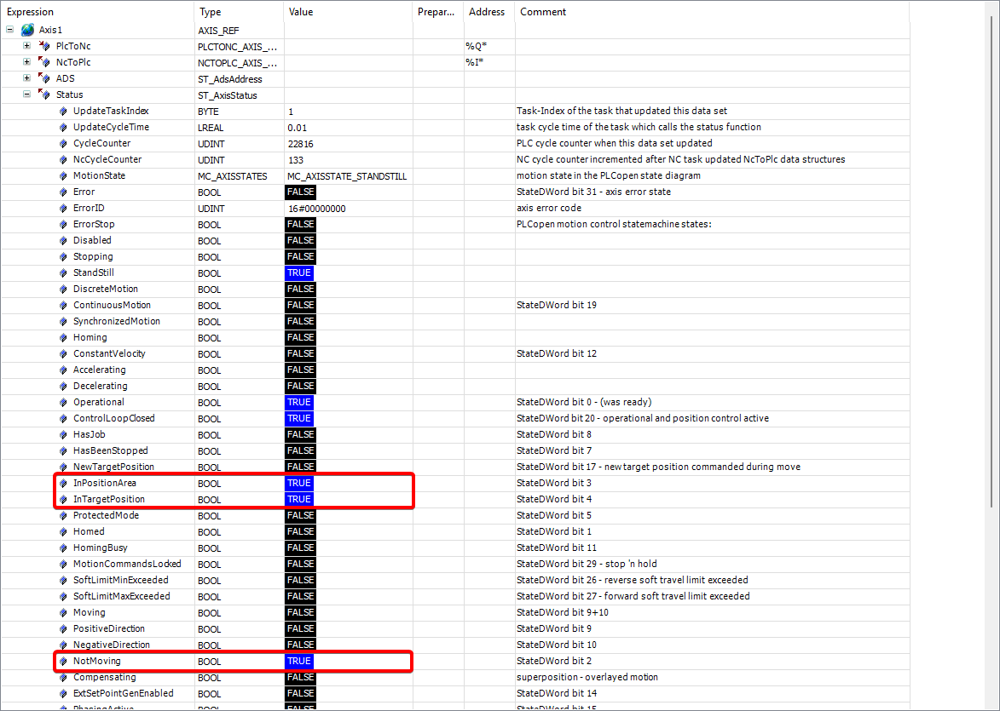
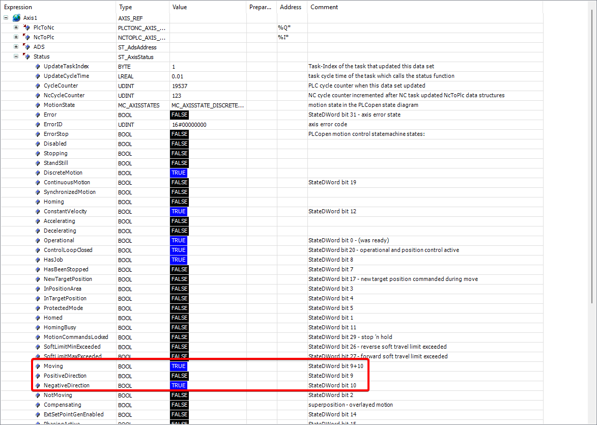
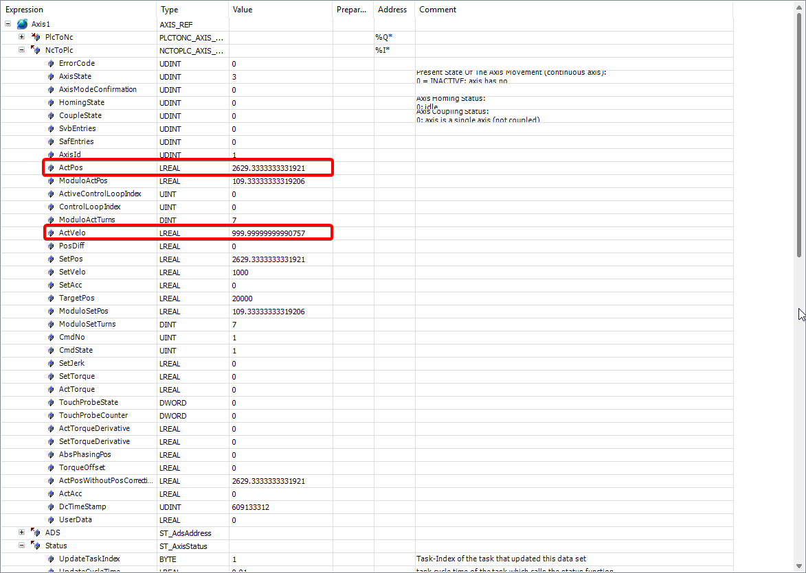

# Diagnostyka osi NC
{: .no_toc }
<h6> Data modyfikacji: 4.12.2025 </h6>
## Table of Contents
{: .no_toc .text-delta }

1. TOC
{:toc}

# Diagnostyka i monitoring osi NC

W przypadku wystąpienia błędów na osi NC (czy to w przypadku problemów hardaware'owych czy software'owych) należy dokonać odpowiedniej diagnostyki. Poniżej opisane będą możliwe źródła błędów, a także różne sposoby ich diagnostyki. 

Opisane również zostaną sposoby monitoringu osi NC, które mogą pomóc w zapobieganiu błędom.

**UWAGA! W niniejszej instrukcji opisana będzie wyłącznie diagnostyka osi NC. Instrukcja nie porusza tematu diagnostyki hardware (serwowzmacniacze, silniki)!**

## Określenie źródła błędu

Błędy mogą pochodzić z trzech źródeł:

* błędy programowe (wynikające wprost z logiki programu)
* błędy osi NC (wynikające z monitorowanych przez jądro NC parametrów)
* błędy hardware'owe (wynikające z problemów sprzętowych)

Błędy propagują się w następujący sposób:



Pochodzenie błędu można określić np. na podstawie jego kodu - więcej w dalszej części opisu.

## Sprawdzenie kodu błędu

W zależności od rodzaju błędu, jego kod można odczytać w różnych miejscach:

* błąd programowy - na wyjściu Error ID odpowiedniego bloku w PLC
* błąd osi NC - w interfejsie NC (opisany [tutaj](https://ba-pl.github.io/wiki/docs/Motion/O%C5%9B%20wirtualna/#r%C4%99czne-sterowanie-osi%C4%85)) oraz na wyjściu Error ID bloków funkcyjnych w PLC (błąd się propaguje)
* błąd hardware'owy - w interfejsie Drive Manager

W przypadku błędów programowych oraz NC kod błędu można sprawdzić w [Infosys](https://infosys.beckhoff.com/content/1033/tc3ncerrcode/1521556875.html)

Kody błędów podzielone są na klasy, które ułatwiają identyfikację źródła błędu:



Błąd NC o numerze 18000 (16#4650) wprost wskazuje na błąd hardware'owy:


## Monitoring osi NC

Monitoringu osi NC można dokonywać w różnych celach. Najpopularniejsze z nich to:

* zapobieganie wystąpieniu błędu - reagujemy, zanim (znane nam) parametry monitorowane przez oś NC zostaną przekroczone
* sprawdzenie gotowości osi do pracy/ruchu
* sprawdzenie możliwości poprawy parametrów pracy - jeśli np. nie osiągamy założonych parametrów dynamiki dzięki wiedzy wynikającej z monitorowania osi możemy je podnieść
* określenie odpowiedniego algorytmu ruchu - czyli np. rozpoczynamy ruch osią nr 2 tylko w przypadku gdy oś 1 jest w odpowiedniej pozycji/stanie (np. zatrzymana czy zreferencjonowana)

### Monitoring z poziomu interfejsu osi NC

Pierwszym ze sposobów monitogringu osi jest obserwacja bitów oraz wartości w interfejsie online osi.



Na tej podstawie można określić m.in.:
* aktualną pozycję i prędkość osi
* jej gotowość do pracy
* aktualny uchyb pozycji dla osi
* statusy osi (porusza się, w którym kierunku, spozycjonowana etc.)

### Monitoring z poziomu programu PLC

Drugi ze sposobów to monitoring osi z poziomu programu PLC.

Aby była możliwość monitoringu, najpierw należy w programie PLC umożliwić odświeżanie bitów statusowych. Można to zrobić na dwa sposoby, wywołując cyklicznie jedną z instrukcji w PLC (obie instrukcje zakładają, że oś nazywa się Axis1):

```
Axis1();
```

Lub

```
Axis1.ReadStatus();
```

Instrukcje te są równoważne. Ważne, aby wykonywana była ona w każdym cyklu PLC. Dzięki tej instrukcji będą odświeżane wartości zaszyte w strukturze AXIS_REF (a konkretniej część Status tejże struktury):



Te parametry można również monitorować, wywołując odpowiednie bity w programie, np.

```
bAxisMoving := Axis1.Status.Moving;
```

Widok pełnej struktury w PLC prezentuje się następująco:

Oś nieruchoma:



Oś w ruchu:



Monitoring parametrów takich jak prędkość, pozycja, uchyb etc. odbywa się na podstawie struktury NcToPlc:



