# Oś wirtualna 
{: .no_toc }
<h6> Data modyfikacji: 18.11.2025 </h6>
## Table of Contents
{: .no_toc .text-delta }

1. TOC
{:toc}


# Uruchomienie osi wirtualnej

Poniżej znajdą Państwo opis uruchomienia tzw. osi wirtualnej - czyli osi, która nie jest powiązana z żadnym urządzeniem fizycznym. Jest to rozwiązanie idealne do nauki czy testowania, zwłaszcza w połączeniu z narzędziem TwinCAT 3 Scope View, w którym można rysować pozycje, prędkości itd.

## Dodanie osi wirtualnej

By rozpocząć pracę z osią symulacyjną, najpierw należy dodać do projektu konfigurację NC. Aby to zrobić należy przycisnąć prawym przyciskiem na folder MOTION znajdujący się w oknie Solution Explorer po lewej stronie, a następnie wybrać opcję Add New Item...

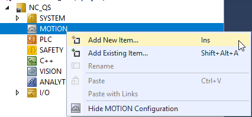

Następnie należy wybrać konfigurację NC/PTP

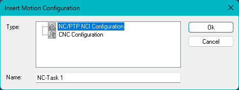

Następnie można dodać jedną lub więcej osi


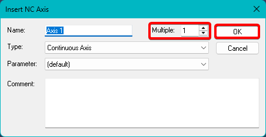

Widok po dodaniu osi

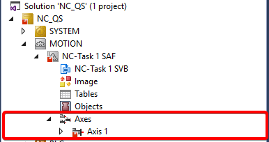

Po aktywacji konfiguracji i restarcie systemu TwinCAT w Run możemy sterować osią na dwa sposoby - ręcznie lub przy pomocy kodu PLC. Poniżej zostaną opisane oba sposoby.

## Ręczne sterowanie osią

W tym rozdziale zostanie opisane poruszanie osią z zakładki System Manager. Wchodząc do zakładki Online danej osi wirtualnej możemy sterować nią wykorzystując poniżej prezentowany interfejs graficzny.

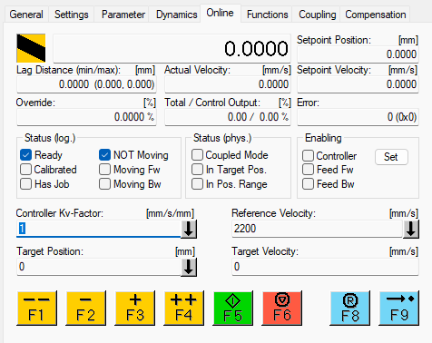

Na początku trzeba zezwolić na sterowanie i ruch osi w obu kierunkach wybierając Set w okienku Enabling i ustawiając wartości w oknie, które się pojawi (alternatywnie można kliknąć All by zezwolić na wszystko oraz ustawić Override na 100%)

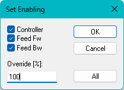

Opis poszczególnych funkcjonalności:

* F1 - szybki ruch w kierunku negatywnym
* F2 - wolny ruch w kierunku negatywnym
* F3 - wolny ruch w kierunku pozytywnym
* F4 - szybki ruch w kierunku pozytywnym
* F5 - rozpoczęcie ruchu z zadanymi w oknie Target Position i Target Velocity parametrami
* F6 - zatrzymanie trwającego ruchu
* F8 - reset osi 
* F9 - rozpoczęcie procedury Homingu

Parametry osi wpływające na powyższe ruchy opisane są [tutaj](tu będzie link do dokumentacji Parametry Osi jak ją zrobię XD)

## Utworzenie programu PLC i przypisanie osi

**UWAGA! W MOMENCIE PRZYPISANIA OSI DO PROJEKTU PLC ZEZWOLENIE NA JAZDĘ MUSI BYĆ JUŻ WYKONYWANE Z PLC, TRACIMY MOŻLIWOŚĆ ROBIENIA TEGO Z OKNA ONLINE OSI!**

Tworzenie projektu PLC opisane jest [tutaj](https://ba-pl.github.io/wiki/docs/TwinCAT%203/QuickStart/#dodanie-projektu-plc)

Po utworzeniu projektu należy dodać bibliotekę Tc2_MC2

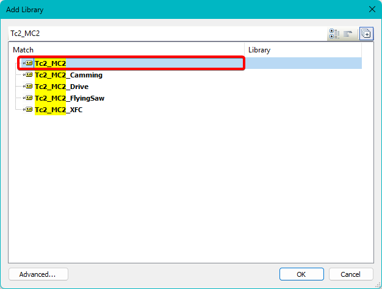

I utworzyć zmienną typu AXIS_REF, na przykład

```
Axis1                   : AXIS_REF;
```

Po przebudowaniu projektu będzie ona dostępna do zlinkowania w oknie Motion

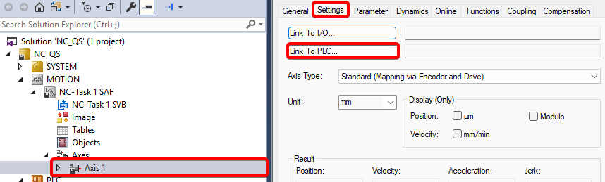

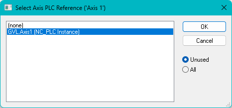

Po zlinkowaniu wyglądać to będzie następująco

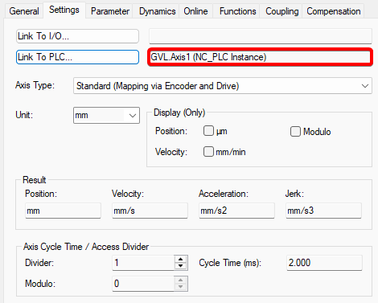

## Utworzenie prostego programu sterującego

Biblioteka Tc2_MC2 oferuje bardzo wiele możliwości sterowania osiami NC, w tym przykładzie jednak będzie to proste sterowanie, oparte na dwóch blokach:

* MC_Power - zezwolenie na ruch osi

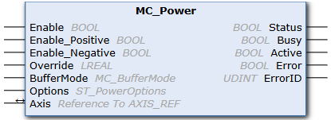

* MC_MoveRelative - przejazd o określoną pozycję z określoną prędkością

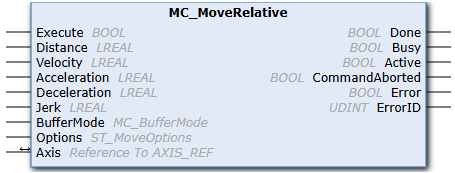

Na początku należy utworzyć listę zmiennych, która może prezentować się następująco:

```
	// Axis Enable
	fbPower		                : MC_Power;
	bEnableControl	                : BOOL;
	bEnablePositiveMovement		: BOOL;
	bEnableNegativeMovement		: BOOL;
	lrOverride	                : LREAL := 100.0;
	
	// Axis Movement
	fbMoveRelative	                : MC_MoveRelative;
	bMove	                        : BOOL;
	lrDistance	                : LREAL;
	lrVelocity	                : LREAL;
```

Kod programu może prezentować się następująco (przypisane są tylko te nóżki w blokach, które są niezbędne do poprawnego zadziałania bloków):

```
fbPower(
	Axis:= GVL.Axis1, 
	Enable:= bEnableControl, 
	Enable_Positive:= bEnablePositiveMovement, 
	Enable_Negative:= bEnableNegativeMovement, 
	Override:= lrOverride);
	
fbMoveRelative(
	Axis:= GVL.Axis1, 
	Execute:= bMove, 
	Distance:= lrDistance, 
	Velocity:= lrVelocity);
```

**Uwaga! W przypadku bloku MC_MoveRelative, jeżeli nie zadeklarujemy wartości Acceleration, Deceleration oraz Jerk zostaną one wzięte z parametrów osi.**

Powyższy program realizuje następującą funkcjonalność:

1. Po ustawieniu zmiennych bEnableControl oraz obu zmiennych bEnableMovement na wartość TRUE oś jest "zazbrojona" i zyskujemy możliwość sterowania oraz ruchu w obu kierunkach.
2. Po wykryciu zbocza narastającego na zmiennej bMove oś przejedzie o dystans lrDistance z prędkością lrVelocity.
3. Ponowne wywołanie bMove spowoduje kolejny ruch - blok MC_MoveRelative powoduje przejazd **o określoną pozycję**, nie **do określonej pozycji**

**Należy pamiętać, że ruch można wykonywać tylko wówczas, gdy oś ma status Enable!**

