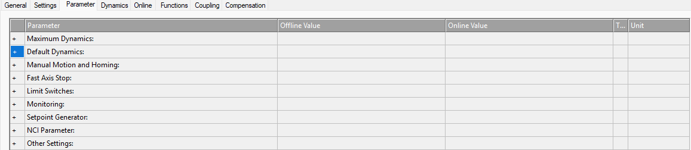

# Parametry osi NC
{: .no_toc }
<h6> Data modyfikacji: 18.11.2025 </h6>
## Table of Contents
{: .no_toc .text-delta }

1. TOC
{:toc}

# Podstawowe parametry osi NC

Oś NC ma szereg konfigurowalnych parametrów, które użytkownik może zmieniać. Część z nich jest stała, część z nich zmienia się w zależności od połączonego z osią NC hardware'u. Niniejszy opis nie będzie opisywać wszystkich możliwych do konfiguracji parametrów, a tylko najważniejsze z nich, które niezbędne są do prawidłowego uruchomienia osi.

Ogólny widok parametrów osi (zakładka Parameter w osi NC) prezentuje się następująco:

## Maximum / Default Dynamics

Zakładki opisujące odpowiednio maksymalną oraz domyślną dynamikę. Zakładki te zmieniają się w zależności od skonfigurowanego hardware'u oraz skalowania w aplikacji.

Zakładka Maximum Dynamics określa nam górną granicę ruchu - jeżeli użytkownik będzie chciał skonfigurować wyższą prędkość/dynamikę, na przykład w bloku funkcyjnym, wartość taka zostanie odrzucona przez jądro NC.

Zakładka Default Dynamics określa wartości domyślne - czyli jeżeli użytkownik nie skonfiguruje dynamiki, np. w blokach MC_MoveRelative czy MC_MoveVelocity dynamika będzie pobrana właśnie z tej zakładki.

## Manual Motion and Homing

Zakładka opisująca prędkości ruchów ręcznych (Jog), dostępnych w zakładce Online osi NC oraz prędkości poszukiwania krańcówki referencyjnej oraz zjadu z niej dla proceduru bazowania. Można tu również zdefiniować krok przy ruchach ręcznych w trybie Inching.

Prędkości w Manual Motion nie mogą być wyższe niż wartości zdefiniowane w Maximum Dynamics.

## Pozostałe zakładki

Pozostałe zakładki w oknie Parameter nie są konieczne do podstawowego, prawidłowego uruchomienia osi NC. Omawiane są one na szkoleniach Motion, na które serdecznie zapraszamy.

Opis szkolenia Motion dostępny jest [tutaj](https://www.beckhoff.com/pl-pl/support/training-offerings/tr2431pl/)