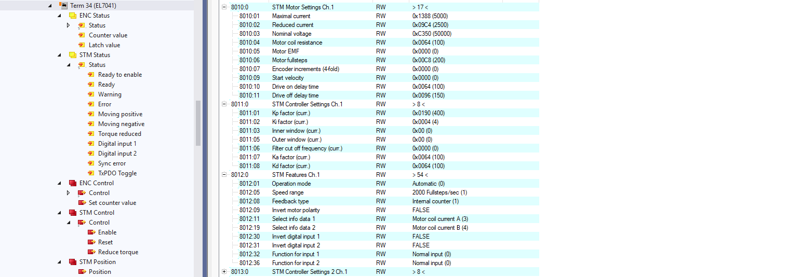
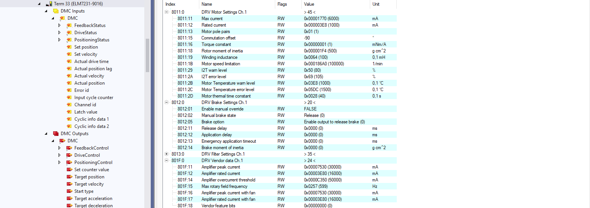
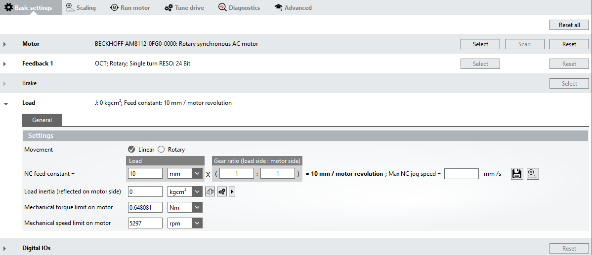
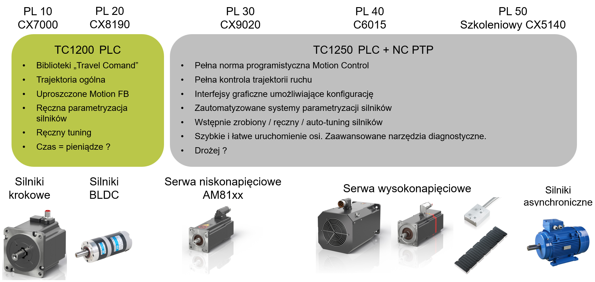

# Podstawy sterowania NC - Idea zastosowania funkcjonalności NC w aplikacjach
<h6> Data modyfikacji: 18.11.2025 </h6>

## Sterowanie ręczne przy pomocy programu PLC

Sterowanie silnikami można realizować przy pomocy licencji TwinCAT PLC - jednakże wiąże się to z ograniczeniami oraz dodatkowym nakładem, który należy wykonać:

* tylko podstawowe sterowanie (włącz/wyłącz, jedź/stój)
* konieczność ręcznego ustawiania słowa kontrolnego
* konieczność ręcznego rozkodowywania słowa statusowego
* tylko proste silniki (krokowe/BLDC)

Taka konfiguracja i uruchomienie wymaga bardzo dużego nakładu pracy programisty, jest trudno powtarzalna i wymaga ręcznej konfiguracji parametrów silnika i nastawów regulatorów. Każda dodatkowa funkcjonalność wymaga oddzielnego okodowania.

## Biblioteka Tc3_DriveMotionControl

Niektóre moduły serii EL72xx oraz ELM72xx wyposażone są w dodatkowe ustawienie w Process Data, tzw. interfejs Drive Motion Control, który pozwala na sterowanie silnikami przy pomocy predefiniowanych bloków. Jest to niepełne odzwierciedlenie biblioteki Motion, które sprawdzi się w prostych, low-costowych aplikacjach. Sama diagnostyka i konfiguracja silnika wciąż jednak odbywa się z poziomu interfejsu modułu, a więc w sposób ręczny.

## Co daje nam zastosowanie jądra NC?

Jądro NC znacząco rozszerza funkcjonalności, jakie oferuje nam licencja TwinCAT PLC - w tym biblioteka Drive Motion Control. Daje ona pełną możliwość konfiguracji i sterowania dowolnymi typami serwowzmacniaczy (AX5xxx, AX8xxx, EL7xxx, ELM7xxx) oraz silników (silniki serii AMxxxx, ALxxxx, AAxxxx, ASxxxx, silniki asynchroniczne). Oferuje ono również:

* pełną obsługę osi w standardzie PLCopen Motion Control
* wygodne, graficzne środowisko do konfiguracji Hardware'u (Drive Manager w wersji 1 oraz 2)
* jednolity sposób programowania osi niezależnie od jej typu (przy użyciu struktury AXIS_REF)
* zaawansowaną diagnostykę dostępną z poziomu narzędzia Drive Manager oraz interfejsu AXIS_REF - brak konieczności ręcznego rozkodowywania słowa statusowego silnika
* gotowe biblioteki Motion umożliwiające wykonanie pełnej aplikacji sterowania point-to-point
* możliwość konfiguracji do 255 osi NC w projekcie (w obecnym standardzie, w przyszłości ilość ta zostanie zwiększona)
* możliwość couplingu (gearingu) osi oraz buforowania komend

Dalsze informacje oraz opis podstawowych funkcjonalności znajdą Państwo w kolejnych podrozdziałach.

---
