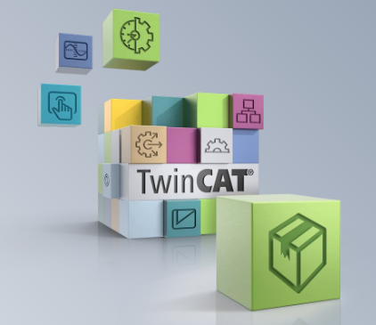

# TwinCAT 3 (wersja 4026)
<h6> Data modyfikacji: 20.12.2024 </h6>
 

TwinCAT 3.1 Build 4026 jest instalowany za pomocą TwinCAT Package Manager. Taki sposób instalacji nie ogranicza TwinCAT’a do trzech wariantów jak w poprzednich wersjach, lecz pozwala instalować, aktualizować i usuwać poszczególne komponenty niezależnie. Użytkownik może określić z jakich komponentów będzie korzystał na komputerze programisty czy sterowniku i zainstalować tylko używane przez niego komponenty.
 
 
TwinCAT Package Manager jest menedżerem pakietów. Komponenty instalowane są jako pakiety w oparciu o format NuGet. Pakiety są pobierane z tzw. źródeł (feeds). Beckhoff udostępnia użytkownikom źródła Stable i Testing (wersja testowa, wymaga akceptacji dodatkowej licencji). Klienci mogą również konfigurować własne źródła w formie katalogu, lokalizacji sieciowej lub serwera pakietów NuGet. Daje to możliwość udostępniania tym kanałem również innych narzędzi na przykład bibliotek PLC, dodatków do edytora a nawet innych aplikacji.
 
 
Za pomocą interfejsu TwinCAT Package Manager użytkownik instaluje tzw. workloady, czyli zestawy pakietów które zależnie od wybranego wariantu tworzą funkcjonalność. Przykładowo na komputerze, gdzie instalujemy środowisko programistyczne (Engineering) nie zawsze potrzebujemy pakietów uruchomieniowych (Runtime), te raczej są potrzebne na sterowniku, gdzie znowu środowisko programistyczne często jest zbędne. W zależności od wariantu Package Manager zainstaluje odpowiednie pakiety, oszczędzając zasoby. W skrócie workloady odpowiadają funkcjom instalowanym w poprzednich wersjach TwinCAT’a, dając większą elastyczność.
 
 
TwinCAT Package Manager składa się z dwóch programów które ze sobą współpracują:
- TwinCAT Package Manager: graficzny menedżer workloadów ułatwiający instalację użytkownikom.
- TcPkg: interfejs wiersza poleceń który jest obsługiwany przez interfejs graficzny do zarządza pakietami.
 
 
Szereg korzyści wynikających z TwinCAT Package Manager wymaga wykonania dodatkowych kroków instalacyjnych na systemach, na których zainstalowano starsze wersje TwinCAT’a. Firma Beckhoff przygotowała narzędzie migracyjne które umożliwia wykonanie przeniesienie obecnej konfiguracji do nowej wersji TwinCAT’a.
 
 
Oficjalne informacje znajdują się w [Infosys.](https://infosys.beckhoff.com/content/1033/tc3_installation/15698617995.html?id=7523796010185393366)