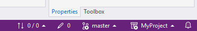

# GIT
{: .no_toc }
<h6> Data modyfikacji: 28.08.2025 </h6>
## Table of Contents
{: .no_toc .text-delta }

1. TOC
{:toc}

## Przygotowanie TwinCAT XAE

Do efektywnego zarządzania kodem źródłowym zaleca się skonfigurować poniższe ustawienia narzędzia inżynierskiego.

* Zapisywanie obiektów TwinCAT w oddzielnych plikach pozwoli na lepsze zarządzanie projektem oraz porównywanie zmian. 
TwinCAT → XAE Environment → File settings.   

* LineID mają znaczenie znaczenie w momencie ustawiania breakpointów. Aby ich stosowanie nie powodowało widocznych zmian, należy odseparować je od kodu źródłowego i stworzyć dla nich odrębny plik.  
TwinCAT → PLC Environment → WriteOptions.  

* Ustawienie domyslnej kontroli wersji na GIT   
Source Control → Plug-in Selection  

## Repozytorium lokalne

### .gitignore
Plik .gitignore określa, które pliki i foldery Git ma pomijać podczas śledzenia zmian w repozytorium. Dzięki temu do historii projektu nie trafiają pliki tymczasowe, konfiguracyjne lub generowane automatycznie.
Przykładowy plik [.gitignore](https://infosys.beckhoff.com/content/1033/tc3_sourcecontrol/14604066827.html).

Taki plik wklejamy do katalogu z projektem.  
  
Należy pamiętać, aby dodać plik jeszcze przed stworzeniem nowego repozytorium. W przeciwnym razie zostanie dodany domyślny plik, który nie zawiera wielu istotnych wpisów.

### Tworzenie nowego repozytorium
Tworzymy repozytorium lokalne klikając w opcję **Create Git Repository...**  

Wybieramy opcję **Local only**  

W prawym dolnym rogu pojaw się informacja o aktualnym stanie naszego repozytorium. Po poprawnym skonfigurowaniu repozytorium, powinniśmy uzyskać taki sam stan jak na zdjęciu.  

* Lokalna ilość commitów
* Ilość zmian od ostatniego commita
* Akualny branch
* Aktualny projekt

### TwinCAT Project Compare
Do porównywania zmian w projektach warto skonfigurować **TwinCAT Project Compare**.  
Narzędzie znajduje się w katalogu Tools po kliknięciu na ikonę TwinCAT'a.  
Należy pamiętać, aby wybrać opcję **Specific Project**, a nie globalne ustawienie w punkcie **(4)**. Należy wybrać plik **..\MyProject\ .git\config**  

### Commitowanie zmian
Zmiany możemy commitować wykorzystując okno **Team Explorer**, gdzie klikamy **Git Changes**.  
  
Znajdują się tam wszystkie zmienione pliki od ostatniego commitu. Również z tego poziomu możemy:
* Wybrać które zmiany chcemy zapisać jako osobny commit
* Porównać plik przed i po zmodyfikowaniu
* Cofnąć zmiany do ostatniego commita

W celu stworzenia commita, wpisujemy nazwę, która jak najlepiej opisuje dokonane zmiany, a następnie klikamy **Commit All**  

### Historia zmian
Całą historię projektu możemy zobaczyć klikając **View all commits**  
  
Z tego poziomu mamy możliwość wykonania kilku istotnych operacji.
1. **Checkout --detached**  
Pozwala zejść z głównej gałęzi na wybrany commit. Służy do szybkiego podejżenia zmian projektu. Po odłączeniu się od głównej gałęzi, nie powinno tworzyć się nowych commitów - w tym celu tworzy się nowe gałęzie czyli branche.
2. **New Tag...**  
Pozwala stworzyć nowy znacznik na commicie. Tagi służą do oznaczania konkretnych commitów jako ważnych punktów w historii projektu.
3. **New branch...**  
Pozwala stworzyć nowego brancha na odpowiednim commicie. Służą one do tworzenia niezależnych linii rozwoju projektu, dzięki czemu można pracować nad nowymi funkcjami, poprawkami czy testami bez ingerowania w główną wersję kodu. Po zakończeniu prac, taką gałąź można połączyć z inną, zachowując pełną historię zmian.
4. **Reset --mixed**  
Operacja pozwoli na usunięcie commita, ale nie usunie zmian, które zostały zapisane. Po wykonaniu tej operacji, zmiany będą widoczne jako niezapisane w oknie **Git Changes**
5. **Reset --hard**  
Usuwanie commita wraz z usunięciem wszyskich zmian zapisanych w commicie.

## Repozytorium zdalne
Repozytorium zdalne w Git to wersja projektu przechowywana na zewnętrznym serwerze (np. GitHub, GitLab, Bitbucket, Azure DevOps), do której może mieć dostęp wiele osób.
Służy do synchronizacji zmian, umożliwiając współpracę zespołową i backup kodu.
### Wysyłanie projektu do nowego repozytorium
W celu wysłania projektu na repozytorium zdalne, należy w oknie **Git Changes** kliknąć przycisk Push.  
  

Za pierwszym razem, pojawi się okno, które pozwoli podpiąć repozytorium lokalne z istniejącym repozytorium zdalnym. Wybieramy opcję **Existing Remote** i wklejamy adres URL, na którym znajduje się zdalne repozytorium.

Po kliknięciu przycisku **Push** cały projekt zostanie wysłany na zdalne repozytorium. W prawym dolnym rogu wyzerowane zostaną liczniki commitów.  

Podczas pierwszego wysyłania projektu, może pojawić się konieczność autoryzacji połączenia z serwisem, na którym znajduje się zdalne repozytorium.

### Pobieranie projektu z istniejącego repozytorium
Aby pobrać projekt z istniejącego już zdalnego repozytorium należy dokonać operacji klonowania.

Otwieramy pustą instancję TwinCAT XAE i wybieramy z paska narzędzi opcję **Git → Clone Repository...**  

Wybieramy miejsce gdzie projekt ma zostać zapisany oraz podajemy adres URL zdalnego repozytorium.  

Po kliknięciu przycisku **Clone**, cały projekt wraz z całą historią zmian zostanie pobrany do wybranego folderu.