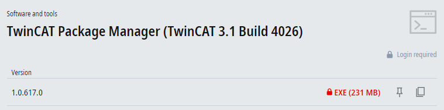

# TwinCAT 3 
<h6> Data modyfikacji: 20.12.2024 </h6>
 

Obecnie na stronie [Beckhoff](https://beckhoff.com) są dostępne dwie wersje TwinCAT 3:
- 3.1.4024.x w której wprowadzane są już tylko poprawki

- 3.1.4026.x która jest aktualnie rozwijana

 
Instalacja wersji 4024 pozwala na obsługę wszystkich obecnych urządzeń działających pod TwinCAT 3, oraz może być zaistalowana na komputerze programisty równolegle z oprogramowaniem TwinCAT 2. Nie zawiera jednak kilku usprawień, które zostały wprowadzone w wersji 4026. Dokładny opis nowych funkcji znajduje się [tutaj](https://infosys.beckhoff.com/english.php?content=../content/1033/tc3_plc_intro/13729845515.html)
 
 
Wersja 4026 wymaga, aby na sterowniku który będziemy programować, również znajdował się TwinCAT 3 w wersji 4026. Na ten moment nie wszystkie sterowniki mają fabryczne obrazy systemu z tą wersją, czasami wymagany jest samodzielny upgrade. Wersja 4026 ma rówież możliwość zainstalownia **Remote Managera** do wersji 4024, co umożliwa pracę ze sterownikami posiadającymi system operacyjny Windows CE (Windows CE wspiera TwinCAT 3 jedynie do wersji <= 4024).
 
Nie ma obecnie również możliwości równoległej instalcji TwinCAT 3 w wersji 4026 oraz TwinCAT 2 na tym samym komputerze. 

