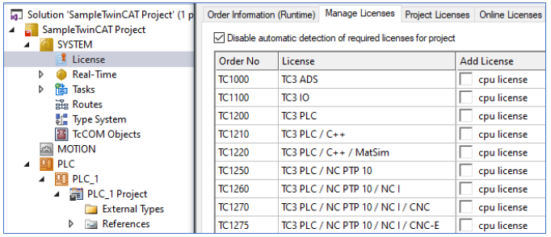
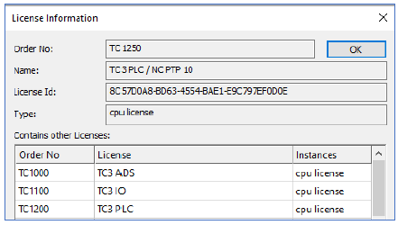
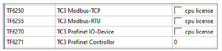
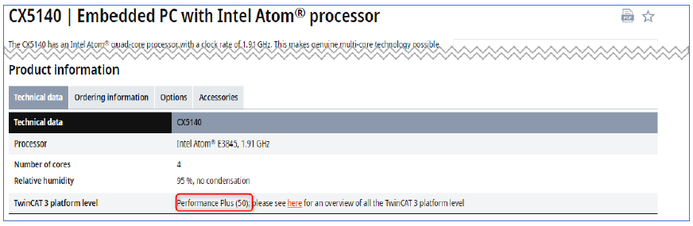
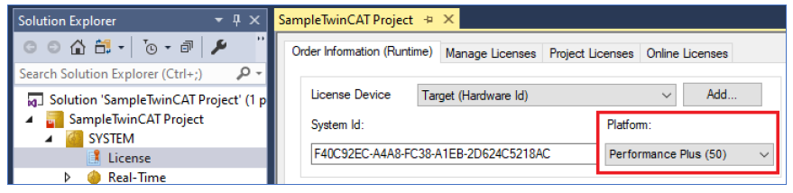
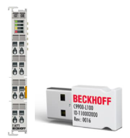

**Licencjonowanie**
<h6> Data modyfikacji: 20.12.2024 </h6>
 
 
Licencje w TwinCAT 3 będziemy dzielić na różne grupy, w zależności od kryterium.
 
Podstawowy podział to podział na licencje Runtime (do uruchomienia aplikacji na sterowniku) oraz na licencje do narzędzia inżynierskiego.

Podstawowa wersja narzędzia inżynierskiego jest darmowa, jedynie niektóre rozszerzenia są dodatkowo płatne, jak np. licencja TE1510 Cam Design Tool. Licencje TExxxx nie mają też z reguły opcji wygenerowania 7-dniowej licencji próbnej lub licencja testowa jest ograniczona.
 
Aby uruchomić aplikację na sterowniku, musi się na nim znajdować przynajmniej jedna z licencji TCxxxx. Wybiera się ją na podstawie aplikacji, np. w zależności od tego czy potrzebujemy sterowania osiami czy nie. Lista najczęściej używanych licencji:

Jeśli więc potrzebujemy w naszej aplikacji sterowania osiami, wybierzemy licencję TC1250. Licencja ta zawiera w sobie już wszystkie „niższe” licencje:

Następnie, jeśli potrzebujemy w naszej aplikacji dodać np. komunikację z innymi urządzeniami za pomocą protokołu Modbus TCP, to będziemy dokładać licencje TFxxxx (Functions), w przypadku Modbus TCP - TF6250. Licencje TFxxxx nie mogą być uruchomione bez licencji TCxxxx.

Co do zasady, zdecydowaną większość licencji TCxxxx oraz TFxxxx można uruchomić w trybie testowym.
 
Jeśli wiemy już jakich licencji potrzebujemy, w kolejnym kroku musimy wyspecyfikować na jakim typie urządzenia (o jakiej wydajności) będziemy je uruchamiać. Od tego jest uzależniona cena danej licencji. Klasę wydajności każdego sterownika możemy znaleźć w jego karcie katalogowej, np. dla CX5140:

Lub w TwinCAT:

Na tym etapie nasz numer zamówieniowy licencji dla licencji PLC/NC PTP będzie wyglądał tak:
- TC1250-0050, gdzie -xx50 oznacza klasę wydajności.

 
Ostatni etap, to decyzja w jaki sposób będziemy przechowywać licencję. Do wyboru są 3 opcje:
- bezpośrednio na sterowniku: w przypadku awarii sterownika i wymiany na nowy, trzeba będzie przejść procedurę przeniesienia licencji. W tym czasie można uruchomić aplikację za pomocą 7-dniowych licencji testowych
- na module EL6070 (tylko magistrala EtherCAT): licencja jest aktywna tam, gdzie znajduje się moduł, w przypadku awarii sterownika nie trzeba nic robić w kwestii licencji
- na kluczu USB C9900-L100 (tylko dla sterowników z portem USB): licencja jest aktywna tam, gdzie znajduje się klucz, w przypadku awarii sterownika nie trzeba nic robić w kwestii licencji

Niezależnie od wybranego sposobu, kopia pliku licencyjnego jest zawsze przechowywana na sterowniku w katalogu instalacyjnym TwinCATa **...\TwinCAT\3.1\Target\License**
 
W przypadku awarii urządzenia licencję z reguły można przenieść, należy w tej sprawie skontaktować się z działem technicznym **support@beckhoff.pl**
 

---