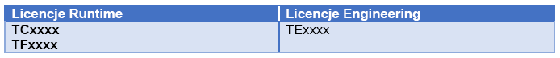

**Licencjonowanie**

Licencje w TwinCAT 3 będziemy dzielić na różne grupy, w zależności od kryterium.
 
Podstawowy podział to podział na licencje Runtime (do uruchomienia aplikacji na sterowniku) oraz na licencje do narzędzia inżynierskiego.

Podstawowa wersja narzędzia inżynierskiego jest darmowa, jedynie niektóre rozszerzenia są dodatkowo płatne, jak np. licencja TE1510 Cam Design Tool. Licencje TExxxx nie mają też z reguły opcji wygenerowania 7-dniowej licencji próbnej lub licencja testowa jest ograniczona.
 
Aby uruchomić aplikację na sterowniku, musi się na nim znajdować przynajmniej jedna z licencji TCxxxx. Wybiera się ją na podstawie aplikacji, np. w zależności od tego czy potrzebujemy sterowania osiami czy nie. Lista najczęściej używanych licencji:

Jeśli więc potrzebujemy w naszej aplikacji sterowania osiami, wybierzemy licencję TC1250. Licencja ta zawiera w sobie już wszystkie „niższe” licencje:

Następnie, jeśli potrzebujemy w naszej aplikacji dodać np. komunikację z innymi urządzeniami za pomocą protokołu Modbus TCP, to będziemy dokładać licencje TFxxxx (Functions), w przypadku Modbus TCP - TF6250. Licencje TFxxxx nie mogą być uruchomione bez licencji TCxxxx.

Co do zasady, zdecydowaną większość licencji TCxxxx oraz TFxxxx można uruchomić w trybie testowym.
---