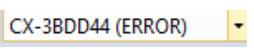

# Połączenie ze sterownikiem poprzez port przekierowany
{: .no_toc }
<h6> Data modyfikacji: 20.12.2024 </h6>
## Table of Contents
{: .no_toc .text-delta }

1. TOC
{:toc}

Niniejsza instrukcja opisuje sposób połączenia się ze sterownikiem poprzez port przekierowany. W pierwszym rozdziale podana jest przykładowa topologia sieci służącej do połączenia ze sterownikiem, dalej opisane są porty, które należy przekierować w celu uzyskania konkretnych funkcjonalności sterownika, a następnie opisany jest sposób przykładowej konfiguracji routera i połączenia się ze sterownikiem z Windows CE.

# Przykłądowa topologia

# Porty wykorzystywane w Beckhoff

Aktualną listę portów znajdziesz w [Infosys.](https://infosys.beckhoff.com/english.php?content=../content/1033/ipc_security_wince/11019143435.html)

# Przykładowe ustawienie routera

# Nawiązywanie połączenia z urządzeniem wyposażonym w system operacyjny Windows CE
Aby nawiązać połączenie musimy dodać wpis o połączeniu w rejestrze systemu Windows. Do tego celu wykorzystujemy program TwinCAT System Manager. Wybieramy w nim opcję Choose Target System\Search(Ethernet) i uzupełniamy odpowiednie pola w oknie Add Route Dialog (opis poniżej). Wpisów musimy dokonać ręcznie, nie zadziała w tym przypadku komenda Broadcast Search.

Kolejne kroki:

- Wpisujemy adres zewnętrznego IP urzadzenia
- Wciskamy przycisk Enter Host Name/IP
- Wyświetli się nam nazwa sieciowa urządzenia, z którym chcemy się połączyć
- Wybieramy dodawanie po IP Address
- Wciskamy przycisk Add Router
- W polu Connected może nie pojawić się znak „X” oznaczający nawiązanie połączenie.

 
Połączenie nie jest jeszcze aktywne, co pokazuje pasek stanu w oknie głównym:

Spowodowane jest to tym, że w rejestrach urządzenia wpisany jest wewnętrzny adres IP naszego komputera, a powinien być wpisany zewnętrzny adres IP routera do którego komputer jest podłączony. Zmian dokonujemy w następnym kroku.

# Modyfikacja wpisu w rejestrze Windows CE

Uwaga!! Obrazy Windows CE od wersji TwinCAT 2.11. 2243 lub TwinCAT 3.1 Build 4016.6 mają fabrycznie zablokowany dostęp zdalny za pomocą programu CERHOST. Dalsze czynności nie będą możliwe.
 
Instrukcja odblokowania znajduje się [tutaj.](https://ba-pl.github.io/wiki/docs/IPC/Windows%20CE/CERHOST/)
 
Odnajdujemy wpis w rejestrze dotyczący połączenia z naszym komputerem (w tym przypadku jest to folder DELL) Zmieniamy wpis dotyczący adresu IP - powinien zawierać zewnętrzny adres IP routera za którym znajduje się komputer, z którego programujemy sterownik. Adres ten można sprawdzić np. na stronie [moje IP.](https://www.mojeip.cz)

Resetujemy system:

W programie TwinCAT System Manager widzimy, że nawiązane jest połączenie z urządzeniem:

