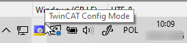
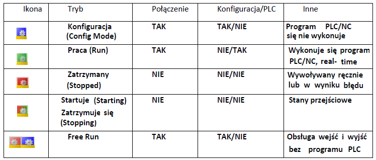
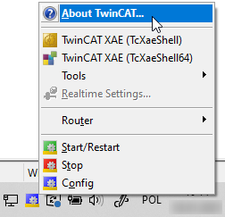
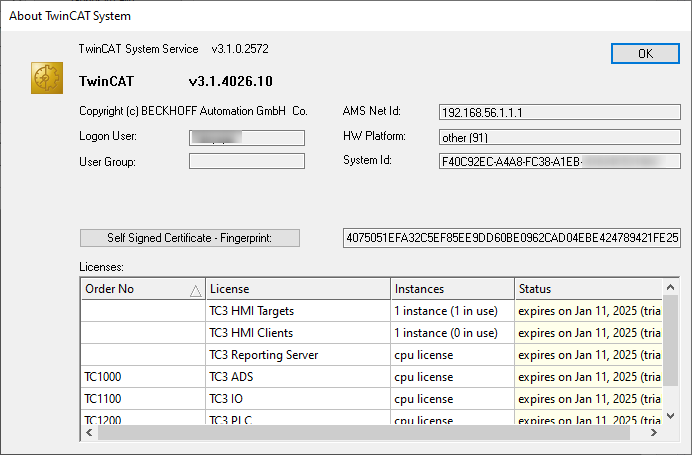
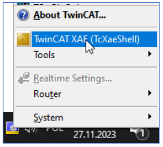

# TwinCAT 3 Quick Start 
{: .no_toc }
<h6> Data modyfikacji: 30.12.2024 </h6>
## Table of Contents
{: .no_toc .text-delta }

1. TOC
{:toc}

# Wprowadzenie

System TwinCAT (The Windows Control and Automation Technology) jest platformą programistyczną dla wszystkich kontrolerów oferowanych przez firmę Beckhoff. Wykorzystuje on protokół komunikacyjny ADS (Automation Device Specification) a urządzenia występujące w tym protokole dostają adresy AMS (Automation Message Specification). 
 
 
System TwinCAT składa się z dwóch części:
- Narzędzie inżynierskie (eXtended Automation Engineering XAE): służy do tworzenia programów, konfigurowania urządzeń itp.
- Środowisko uruchomieniowe (eXtended Automation Runtime XAR): pozwala uruchomić wcześniej napisany program, działa na już przekompilowanym pliku binarnym.

 
Ikona TwinCAT System Service informuje nas o aktualnym stanie TwinCATa na danym urządzeniu.

Stany które mogą wystąpić:

## Właściwości TwinCAT 

W zakładce About TwinCAT:

zawarte są informacje o:
- wersji TwinCAT
- AMS NetId komputera
- HW Platform
- rodzaj licencji i termin jej wygaśnięcia

# Tworzenie nowego projektu 

Aby uruchomić środowisko, klikamy na ikonę TwinCATa i wybieramy opcję TwinCAT XAE:

INFO
{: .label .label-purple }

Jeśli ikona TwinCAT na pasku zadań nie jest widoczna należy ją uruchomić poprzez plik:
 - C:\TwinCAT\3.1\System\TcSysUI.exe dla wersji 4024
 - C:\Program Files (x86)\Beckhoff\TwinCAT\3.1\System\TcSysUI.exe dla wersji 4026
 

