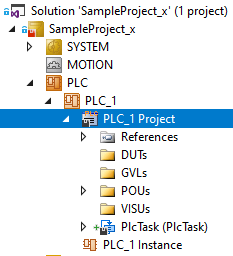

# TwinCAT 3 Quick Start 
{: .no_toc }
<h6> Data modyfikacji: 30.12.2024 </h6>
## Table of Contents
{: .no_toc .text-delta }

1. TOC
{:toc}

# Wprowadzenie

System TwinCAT (The Windows Control and Automation Technology) jest platformą programistyczną dla wszystkich kontrolerów oferowanych przez firmę Beckhoff. Wykorzystuje on protokół komunikacyjny **ADS** (Automation Device Specification) a urządzenia występujące w tym protokole dostają adresy **AMS** (Automation Message Specification). 
<br>
<br>
System TwinCAT składa się z dwóch części:
- Narzędzie inżynierskie (eXtended Automation Engineering **XAE**): służy do tworzenia programów, konfigurowania urządzeń itp.
- Środowisko uruchomieniowe (eXtended Automation Runtime **XAR**): pozwala uruchomić wcześniej napisany program, działa na już przekompilowanym pliku binarnym.

<br>
Ikona TwinCAT System Service informuje nas o aktualnym stanie TwinCATa na danym urządzeniu.


Stany które mogą wystąpić:


## Właściwości TwinCAT 

W zakładce About TwinCAT:


zawarte są informacje o:
- wersji TwinCAT
- AMS NetId komputera
- HW Platform
- rodzaj licencji i termin jej wygaśnięcia


# Tworzenie nowego projektu 

Aby uruchomić środowisko, klikamy na ikonę TwinCATa i wybieramy opcję:
- TwinCAT XAE (TcXaeShell) dla wersji 4024 i straszych
- TwinCAT XAE (TcXaeShell64) dla wersji 4026


<div class="code-example" markdown="1" style="background: rgba(210, 243, 242, 0.8)">

INFO
{: .label .label-purple }

Jeśli ikona TwinCAT na pasku zadań nie jest widoczna należy ją uruchomić poprzez plik:
 - C:\TwinCAT\3.1\System\TcSysUI.exe dla wersji 4024
 - C:\Program Files (x86)\Beckhoff\TwinCAT\3.1\System\TcSysUI.exe dla wersji 4026
 
</div>

Następnie tworzymy nowy projekt korzystając z górnego menu:


Z okna dialogowego które się pojawi należy wybrać TwinCAT XAE Project i potwierdzić wybór (zdjęcie dla wersji 4024):


Wersja 4026: 


Następnie należy wpisać nazwę projektu i ścieżkę i utworzyć projekt.
<br>
<br>
Prawidłowo utworzy projekt:


<div class="code-example" markdown="1" style="background: rgba(210, 243, 242, 0.8)">

INFO
{: .label .label-purple }

Jeśli drzewo projektu nie jest widoczne, należy z górnego menu wybrać **View-->Solution Explorer**
 
</div>

## Nawiązywanie połączenia ze sterownikiem z interfejsem Ethernet

Aby połączyć się ze sterownikiem, na komputerze, z którego konfigurujemy połączenie oraz na sterowniku, TwinCAT powinien znajdować się w trybie **Config** lub **Run** (tryby nie muszą być takie same na obu urządzeniach). Urządzenia muszą się też znajdować w tej samej podsieci. Następie wybieramy opcję **Choose Target System** z górnego menu:


Jeśli naszego urządzenia nie ma na liście należy wybrać opcję **Search (Ethernet)...**


W nowo otwartym oknie **Add Route Dialog** zaznaczamy opcję **Advanced Settings**:


Aby wyszukać urządzenia wybieramy przyciski Broadcast search:


Po wyszukaniu, na liście powinna pojawić się nazwa sieciowa sterownika, która jest generowana na podstawie informacji z tabliczki znamionowej urządzenia.
<br>
Z listy aktualnie dostępnych urządzeń należy wybrać to, z którym chcemy się połączyć - w przykładzie **CP-3E03AC (1)** - uzupełnią się dane dotyczące połączenia. Zmieniamy sposób dodawania wpisu na **IP Address (2)** i klikamy przycisk **Add Route (3)**.


Dodanie nowego połączenia jest chronione hasłem. Jest to hasło do systemu znajdującego się na sterowniku.


Ustawienia fabryczne to następujące dane do logowania:
- Użytkownik: Administrator
- Hasło: 1

<br>
Jeśli udało się nawiązać połączenie to w polu **Connected** okna dialogowego **Add Route Dialog** przy sterowniku, z którym się łączyliśmy pojawi się znak **X**. Może też pojawić się symbol kłódki, jeśli podczas dodawania połączenia zaznaczona była opcja Secure ADS.


Następnie można zamknąć okna dialogowe **Add Route Dialog** a z okna dialogowego **Choose Target System** które się pojawi, wybrać z listy pożądany sterownik.


Automatycznie zostaje rozpoznany rodzaj docelowej platformy i może pojawić się komunikat z propozycją przełączenia się na właściwą, który potwierdzamy:


Nazwa sterownika, z którym nawiązaliśmy połączenie, powinna być teraz widoczna w projekcie:


### Możliwe problemy z uzyskaniem połączenia 

Jeśli pożądane urządzenie nie jest widoczne na liście po wybraniu polecenia Broadcast Search, to problem może być związany z TwinCAT bądź nie. Aby to rozstrzygnąć należy użyć komendy **ping** w wierszu poleceń systemu Windows **cmd** (ping *adres IP sterownika*). Jeśli urządzenie nie odpowiada na komendę ping oznacza to problem nie związany z TwinCAT. Najczęstsze przyczyny to:
- Adres IP sterownika z innej puli niż nasz komputer: sprawdź jaki adres ma sterownik, porównaj z adresem komputera. Adresy powinny być w tej samej puli adresowej ale różne od wszystkich innych urządzeń w sieci (konflikt IP).
- Uszkodzony kabel: jeśli wszystko powyżej zostało sprawdzone i dalej występuje problem z wyszukaniem urządzenia to zmień kabel na inny.

<br>
Jeśli urządzenie odpowiada na komendę **ping** a nadal nie jest widoczne to problem jest związany z TwinCAT. Możliwości:
- Niewłaściwy tryb TwinCATa: TwinCAT na obu urządzeniach musi być w trybie konfiguracji (Config) lub pracy (Run). Jeżeli jest inny tryb to funkcja wyszukiwania jest nieaktywna.
- Nieprawidłowa instalacja TwinCATa: systemy Windows Vista, 7, 8, 10 --> TwinCAT musi być instalowany poprzez kliknięcie PPM na pliku i wybranie funkcji uruchom jako administrator. W przeciwnym wypadku instalacja może nie przebiec prawidłowo.
- Nieprawidłowe uruchomienie TwinCAT: w niektórych przypadkach program musi być również uruchamiany w trybie administratora
- Firewall/AntyVirus blokuje komunikację sieciową: niektóre programy blokują porty wykorzystywane przez TwinCAT-a bądź komendy typu broadcast. Można na czas wyszukiwania urządzeń je wyłączyć.

## Automatyczne wykrywanie kart I/O 

Do automatycznego wyszukiwania urządzeń podłączonych do sterownika służy funkcja **Scan (wywołanie - PPM na Devices)**. Automatyczne wyszukanie urządzeń możliwe jest tylko w trybie **Config Mode**, w trybie Run opcja jest niedostępna. Przełączanie między trybami następuje po wybraniu odpowiedniej ikony z górnego menu:


Po wybraniu opcji Scan pojawi się ostrzeżenie, iż nie wszystkie typy urządzeń mogą być znalezione automatycznie. Komunikat ten należy potwierdzić:


W naszym przypadku komputera C601x zostało znalezione 1 główne urządzenie:


Jest to karta sieciowa, do której zostały podłączone urządzenia komunikujące się po protokole EtherCAT. Aby szczegółowo zeskanować urządzenia, należy zaznaczyć urządzenie **Device 1** i kliknąć OK. Pojawi się okno pytające czy chcemy kontynuować dalsze skanowanie:


Po ukończeniu skanowania możemy aktywować tryb testowy Free Run, dzięki któremu mamy możliwość sprawdzenia poprawności połączeń wejść/wyjść.


Proces wyszukiwania urządzeń został zakończony. Przykładowy widok dolnej części drzewa projektu:


### Tryb Free Run

Tryb Free Run umożliwia testowanie wejść i wyjść zarówno analogowych jak i cyfrowych. Pozwala on wymuszać odpowiednie stany bez potrzeby uruchamiania programu PLC. TwinCAT proponuje przejście w tryb Free Run zaraz po wyszukaniu urządzeń. Ręczne przejście w tryb Free Run jest możliwe tylko z trybu Config. Aby przejść w tryb Freen Run wystarczy kliknąć ikonkę lub wybrać z górnego menu TWINCAT i opcję **Toggle Free Run State:**


Praca sterownika w trybie Free Run jest sygnalizowana przez naprzeminne miganie w prawym dolnym rogu okna TwinaCata ikonek :


**Podgląd zmiennych**
<br>
<br>
Zbiorczy podgląd zmiennych jest możliwy w przypadku kliknięcia w drzewie konfiguracji na pole **Image** pod urządzeniem które jest masterem w danej konfiguracji. Kolumna Online przedstawia aktualne wartości zmiennych. W przypadku zmiennych wyjściowych możliwe jest wpisanie własnej wartości, W tym celu należy kliknąć PPM na zmiennej i wybrać opcję **Online Write**:


Zmienne cyfrowe przyjmują wartości 0 lub 1, natomiast wartości analogowe najlepiej wpisywać w polu wartości przeskalowanych(1) (system sam rozpoznaje rodzaj i zakres modułu).


### Moduły I/O Beckhoff 

<br>


## Dodanie projektu PLC

Jeśli chcemy stworzyć nowy projekt PLC to należy kliknąć w drzewie konfiguracji PPM na element PLC i wybranie **Add New Item**. Następnie z dostępnych opcji można wybrać **Standard PLC Project**, nadać mu nazwę i zatwierdzić przyciskiem **Add**:


W drzewie projektu pojawią się nowe foldery:
- External Types: typy zewnętrzne
- References: referencje do bibliotek
- DUTs: Data Type Units --> typy danych definiowalnych przez użytkownika
- GVLs: Global Variable Lists -->  listy zmiennych globalnych
- POUs: Program Organization Units -->  pliki programów, bloków funkcyjnych, funkcji etc.
- VISUs: Visualizations -->  pliki wizualizacji



Na tym etapie można przejść do deklaracji zmiennych. W tym celu dodajemy listę zmiennych globalnych:


Deklarujemy zmienne jak na zdjęciu poniżej:


```
bPrzycisk1	AT%I*	: BOOL;
bPrzycisk2	AT%I*	: BOOL;
bPrzycisk3	AT%I*	: BOOL;
bPrzycisk4	AT%I*	: BOOL;

bLampka1		AT%Q*	: BOOL;
bLampka2		AT%Q*	: BOOL;
bLampka3		AT%Q*	: BOOL;
bLampka4		AT%Q*	: BOOL;

iPotencjometr1	AT%I*	: INT;
iPotencjometr2	AT%I*	: INT;

iWyswietlacz1	AT%Q*	: INT;
iWyswietlacz2	AT%Q*	: INT;
```

Aby wygenerowały się symbole do linkowania, należy wykonać kompilację projektu (opis w kolejnym rozdziale).
<br>
Kompilacja rozpocznie się po wybraniu z menu opcji **BUILD --> Rebuild** *nazwa projektu*:


O tym, czy kompilacja się powiodła, poinformuje nas okno **Output** znajdujące się zazwyczaj w dolnej części środowiska:


### Typy i deklracja zmiennych 

Ogólna struktura deklaracji zmiennych przedstawiona jest poniżej:


TwinCAT pozwala na zadeklarowanie dwóch grup zmiennych.
- zmienne nieadresowane (lokalne): używane w obrębie sterownika. Zmienne te nie mogą odwoływać się do urządzeń zewnętrznych. Deklaracja takiej zmiennej składa się z nazwy zmiennej i typu zmiennej. Przykład:


- zmienne zewnętrzne: łączone są z fizycznymi urządzeniami w procesie linkowania. Deklaracja takiej zmiennej składa się z dodatkowego słowa kluczowego AT oraz określenia rodzaju zmiennej i podania adresu zmiennej. Przedrostek zmiennej I,Q,M występujący po znaku % wskazuje obszar do jakiego zmienna będzie się odwoływać.
	- I –-> obszar wejść (Input);
	- Q –-> obszar wyjść (Output);
	- M –-> pamięć flag (Memory);
	
Kolejnym elementem deklaracji jest określenie adresu zmiennej:
- X --> zmienna bitowa (logiczna), wyrażona przez pojedynczy bit
- B --> zmienna bajtowa (Byte), wyrażona przez 8 bitów

<br>
\* - informuje, że adres będzie przydzielony podczas kompilowania


W bibliotece standardowej zdefiniowane zostały podstawowe typy zmiennych przedstawione w tabeli poniżej:


## Linkowanie zmiennych 

Linkowanie zmiennych jest procedurą przypisującą nazwie zmiennej z projektu PLC konkretne wejście lub wyjście fizyczne. Wykonuje się ją w następujący sposób:
- jeśli chcemy zlinkować zmienną która ma być wejściem cyfrowym, odszukujemy w drzewku moduł wejść cyfrowych (kolor żółty), po dwukrotnym kliknięciu powinna pojawić nam się lista, która zawiera m.in. listę dostępnych kanałów:


- klikamy 2xLPM na kanale do którego chcemy zlinkować zmienną


- W oknie które otworzy wskazujemy odpowiednią zmienną. W tym wypadku jest to zmienna globalna bPrzycisk1. Jeśli dodatkowo zaznaczymy opcję **Take over**, kanał przejmie nazwę zmiennej. Wybór zatwierdzamy przyciskiem OK.


Po tych czynnościach, w kolumnie obok nazwy kanału, powinien pojawić się znak X.


## Przyładowy kod programu 

Przykładowy kod będzie realizował załączenie wyjścia cyfrowego z opóźnieniem.
<br>
W tym celu do projektu dodajemy nowy program w języku CFC:


W oknie które się pojawi możemy nadać nazwę obiektu, wybrać czy ma to być program, funkcja czy blok funkcyjny oraz w jakim języku ma zostać stworzona/y.
- **Program** może być wywoływany bezpośrednio przez task lub w innym programie. W programie mogą być wywoływane funkcje, bloki funkcyjne i inne programy.
- **Function block (blok funkcyjny)** może być wywołany w innym bloku lub programie. Sam może wywołać blok funkcyjny bądź funkcję.
- **Function (funkcja)** może wywoływać tylko inne funkcje, a sama może być wywoła wszędzie. Może mieć wiele wejść, a tylko jedno wyjście - zwracające jej wartość.

<br>
W TwinCAT dostępne są następujące języki programowania oraz edytory:
<br>
**Tekstowe:**
- Instruction List (IL)
- Structured Text (ST)

**Graficzne:**
- Ladder Diagram (LD)
- Function Block Diagram (FBD)
- Continuous Function Chart (CFC)
- Sequential Function Chart (SFC)
- UML Statechart (SC) (dodatkowa licencja)

<br>
Następnie w dodanym programie przeciągamy z przybornika (standardowo okienko Toolbox po prawej stronie) przeciągamy w obszar kodu element **Box** :


<div class="code-example" markdown="1" style="background: rgba(210, 243, 242, 0.8)">

INFO
{: .label .label-purple }

Jeśli okno Toolbox nie jest widoczne, można je uaktywnić z górnej wstążki poprzez **View --> Toolbox**
 
</div>

Po wstawieniu elementu **Box** zaznaczamy znaki zapytania znajdujące się wewnątrz Boxa i wybieramy skrót klawiszowy F2 (bądź klikamy na szary prostokąt, który pojawi się po prawej stronie). Powinno pojawić się okno **Input Assistant**, w którym wyszukujemy i wybieramy blok funkcyjny timera TON:


Po pojawieniu się wewnątrz Boxa nazwy TON, zatwierdzamy przyciskiem Enter.
<br>
Na górze boxa pojawi się jego unikatowy identyfikator (domyślnie TON_0), który można edytować. W przykładzie będzie to nazwa ton1:


Po wpisaniu nazwy i wciśnięciu **Enter** pojawi się okno **Auto Declare**, które w tym wypadku należy zatwierdzić bez wprowadzania żadnych zmian.
<br>
Powinno to spowodować pojawienie się wpisu w oknie deklaracji:


Następnie podpinamy symbole ze zmiennych globalnych na wejścia i wyjścia timera.
<br>
W tym celu, klikamy na nóżkę(linię) przy wejściu **IN** i zaczynamy wpisywać na klawiaturze nazwę listy zmiennych globalnych **GVL_IO**, którą wcześniej utworzyliśmy i wybieramy z listy zmienną *bPrzycisk*. Analogicznie na wyjście **Q** podpinamy zmienną *bLampka:*


Aby podpiąć czas, który ma upłynąć od momentu wciśnięcia przycisku do momentu zapalenia się lampki, należy odpowiednio skonfigurować wejście PT. Można w tym celu bezpośrednio na nóżce wpisać jednostkę czasu, np.: T#1s


Można w tym miejscu też umieścić zmienną, której przypiszemy odpowiednią wartość początkową:


Aby program P_CFC1 w naszym przykładzie działał, należy wywołać go w programie MAIN:


## Aktywacja konfiguracji

Aby aktywować konfigurację (a tym samym przesłać cały projekt na sterownik) wybieramy ikonę z górnego menu:


**UWAGA: Zgoda na aktywację aktualnej konfiguracji oznacza nadpisanie wcześniejszej!**


Okno aktywacji konfiguracji informuje nas o tym jaki projekt jest wgrywany na jaki sterownik. Dodatkowo, można na tym etapie już zdecydować, czy dany projekt PLC ma stać się projektem bootowalnym (uruchamianym wraz ze startem TwinCAT). Jeśli chcemy aby projekt od razu wystartował, należy ten checkbox zaznaczyć.
<br>
Podczas aktywowania konfiguracji może pojawić się komunikat o brakującej licencji i propozycja wygenerowania 7 dniowej testowej licencji:


Jeśli będziemy chcieli wygenerować taką licencję trzeba będzie przepisać kod z obrazka w oknie, które się pojawi:


Następnie system proponuje przejście TwinCATa na obiekcie docelowym w tryb RUN. Jeśli chcemy już uruchomić program, komunikat ten należy potwierdzić.


## Uruchomienie programu 
Gdy program jest poprawnie skompilowany, urządzenie docelowe poprawnie wybrane, zmienne zlinkowane i wgrana konfiguracja, można przystąpić do testowania programu. Aby się zalogować na sterownik można kliknąć na ikonkę :


Jeśli podczas aktywacji konfiguracji nie była zaznaczona opcja dotycząca projektu bootowalnego, pojawi się komunikat dotyczący wgrywania kodu PLC na sterownik:


Następie, jeśli aktywny jest przycisk **Start**, można uruchomić program **(jeśli nie jest aktywny, to znaczy, że program jest już uruchomiony):**


Po zalogowaniu, w podglądzie online programu powinniśmy widzieć stany sygnałów. Po wciśnięciu Przycisku na stanowisku, po sekundzie powinna zapalić się lampka:


## Automatyczny start projektu 

Aby upewnić się, że projekt wystartuje po wyłączeniu i włączeniu zasilania, należy sprawdzić dwa ustawienia:
- projekt bootowalny 


- sposób (tryb) uruchamiania TwinCATa po stracie systemu


## Edycja kodu

Aby móc dalej edytować kod, należy być wylogowanym z podlądu online:


Po wykonaniu edycji kodu, aby wgrać go na sterownik, można ponownie wykorzystać opcję **Login** (nie jest wymagana aktywacja konfiguracji):


Pojawi się okno:


- Login with online change --> wgranie zmian bez zatrzymania programu
- Login with download --> wgranie zmian z zatrzymaniem programu i inicjalizacją zmiennych 
- Login without any change --> zaloguj bez wprowadzania zmian

Opcjonalnie dostępna jest opcja *Update boot project* --> czyli wprowadzone zmiane zostaną zapamiętane na sterowniku.

Czasami, jeśli wprowadzone zmiany są zbyt duże, pojawi się komunikat mówiący o tym, że wgranie zmian jest możliwe tylko w trybie **Downlonad**:


