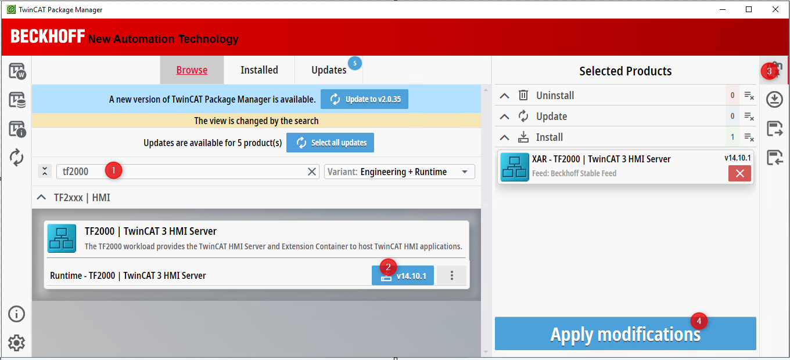
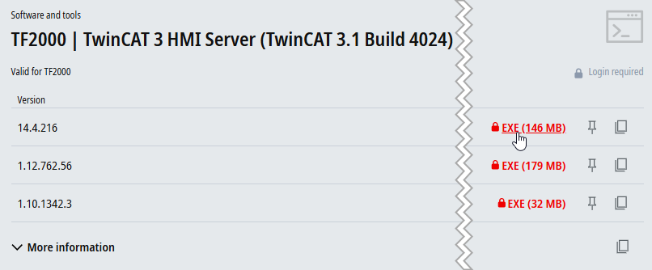
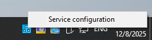
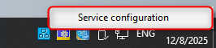
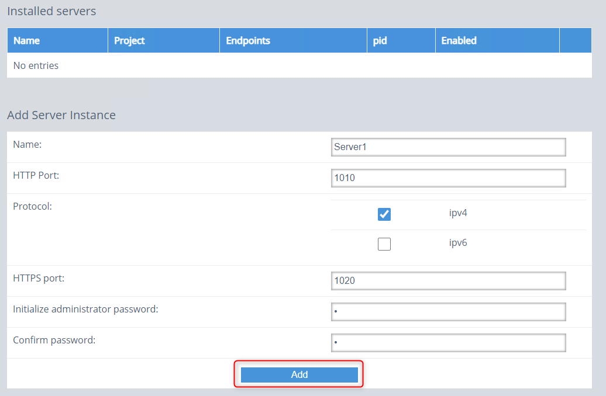
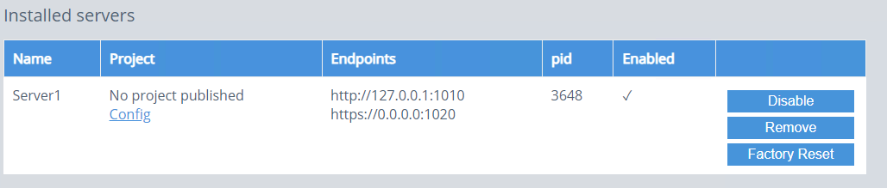
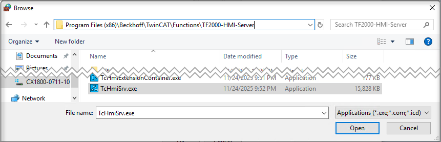
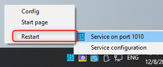
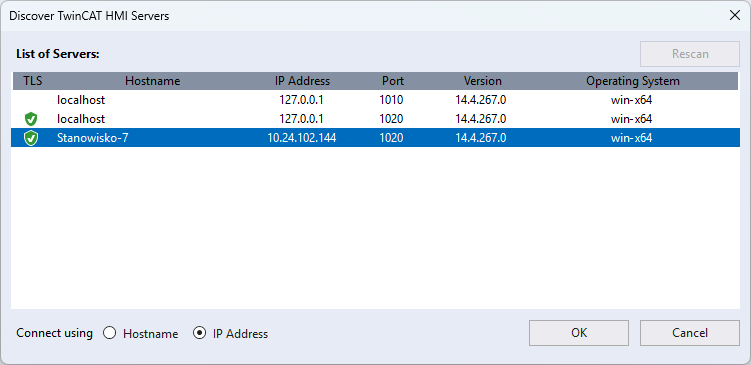

# Konfiguracja serwera i publikacja aplikacji 
{: .no_toc }
<h6> Data modyfikacji: 4.12.2025 </h6>
## Table of Contents
{: .no_toc .text-delta }

1. TOC
{:toc}

# Wersja 1.12 

## Instalacja 
Zaczynamy od pobrania i instalacji wersji 1.12 (wersja dla osób pracujących z narzędziem inżynierskim TwinCAT XAE Shell do wersji 4024 włącznie):
- na stronie [Beckhoff](https://www.beckhoff.com/pl-pl/) wyszukujemy frazę **TF2000**
- pobieramy instalator

- instalujemy produkt na urządzeniu docelowym (czyli tym, które ma hostować aplikację HMI; może być to inne urządzenie niż to, które poźniej będzie wizualizację wyśwetlać)
- po instalacji na pasku systemowym pojawi się ikona serwera

## Generowanie licencji

Aby móc skonfigurować serwer HMI, musi być aktywna licencja TF2000 (może być to licencja trial).
Należy więc otworzyć dowolny projekt TwinCAT, nawiązać połączenie ze sterownkiem na którym znajduje się HMI server (wymagany XAR TwinCAT) i wygenerować licencję.

Po wygenerowaniu licencji należy przeładować stan TwinCATa (np. ponownie do Run lub Config), aby status licencji był poprawny.

## Utworzenie hasła

Przed rozpoczęciem docelowej konfiguracji serwera, należy go zrestartować:

Następnie otwieramy panel konfiguracyjny:

Za pierwszym razem należy ustawić hasło, które będzie potem używane do zmiany konfiguracji jak i publikacji projektu:

Powinna otworzyć się strona konfiguracyjna - dalsze ustawienia robimy wedle potrzeb. 

## Dodanie wyjątku do zapory sieciowej

Aby serwer był widoczny dla innych urządzeń (m.in. dla komputera z narzędziem inżynierskim), należy dodać wyjątek do zapory.
Robimy to w krokach:
- otwieramy Panel Sterowania 

- wyszukujemy ustawienia zapory i wybieramy opcję **Allow an app through Windows Firewalll**

- klikamy przycisk **Allow another app**

- następnie **Browse**

- wskazujemy plik **TcHmiServer.exe** z lokalizacji **C:\TwinCAT\Functions\TF2000-HMI-Server**

Zatwierdzamy zmiany. 

## Publikowanie aplikacji 

Aby przesłać gotową aplikację z narzędzia inżynierskiego na docelowy serwer, klikamy PPM na nazwie projektu i wybieramy opcję *Publish to TwinCAT HMI Server*:

Nadajemy nazwę profilu, pod którą będą zapisane dane serwera:

Następnie, wyszkujeemy dostępne w sieci serwery:

Wybieramy serwer z listy (sterownik):

Uzupełniamy hasło i sprawdzamy połączenie:

Powienien pojawić się komunikat:

W następnym kroku wykonujemy operację *Publish*:

Jeśli pojawi się ostrzeżenie jak poniżej:

to można anualować proces, zmienić platfromę na TwinCAT HMI:

i ponowić publikację. 
Status publikacji można obserwować w oknie *Output*:

Po zakończonej publikacji można otworzyć wizualizację na kilka sposobów:
- z zewnętrznego urządzenia podając adres: https://adresIP_serwera:1020

- lokalnie 
	- na urządzeniu z serwerem: http://127.0.0.1:1010
	- kilkając na ikonę serwera i opcję *Start Page*
	
	

# Wersja 1.14

## Instalacja 

Instalujemy produkt na urządzeniu docelowym (czyli tym, które ma hostować aplikację HMI; może być to inne urządzenie niż to, które poźniej będzie wizualizację wyśwetlać).
 
Jeśli na sterowniku znjaduje się Runtime w wersji 4026 oraz Package Manager, instalujemy za pomocą Package Managera workload TF2000:

	

Jeśli na sterowniku jest Runtime 4024 i chcielibyśmy używać serwera w wersji 1.14, można zainstalować paczkę standalone (narzędzie inżynierskie HMI na naszym komputerze do tworzenie projektów musi mieć wtedy TwinCATa 4026 i HMI 1.14):
Paczkę można pobrać ze [strony:](https://www.beckhoff.com/pl-pl/support/download-finder/search-result/?download_group=168440581&download_item=840622873)

	

Niezależnie od wybranej metody, po instalacji na pasku systemowym pojawi się ikona serwera:

	

## Generowanie licencji

Aby móc skonfigurować serwer HMI, musi być aktywna licencja TF2000 (może być to licencja trial).
Należy więc otworzyć dowolny projekt TwinCAT, nawiązać połączenie ze sterownkiem na którym znajduje się HMI server (wymagany XAR TwinCAT) i wygenerować licencję.

Po wygenerowaniu licencji należy przeładować stan TwinCATa (np. ponownie do Run lub Config), aby status licencji był poprawny.

## Utowrzenie instancji serwera

Aby utworzyć nową instację serwera (musi istnieć przynajmniej jedna), klikamy na ikonę serwera i wybieramy opcję *Service Configuration*:

Uzupełanimy nazwę, porty oraz hasło dla serwera, a następnie zatwierdzamy zmiany przyciskiem *Add*:

Instancja powinna pojawić się w górnej części strony:

## Dodanie wyjątku do zapory sieciowej

Aby serwer był widoczny dla innych urządzeń (m.in. dla komputera z narzędziem inżynierskim), należy dodać wyjątek do zapory.
Robimy to w krokach:
- otwieramy Panel Sterowania 

- wyszukujemy ustawienia zapory i wybieramy opcję **Allow an app through Windows Firewalll**

- klikamy przycisk **Allow another app**

- następnie **Browse**

- wskazujemy plik **TcHmiServer.exe** z lokalizacji **C:\Program Files (x86)\Beckhoff\TwinCAT\Functions\TF2000-HMI-Server**

Zatwierdzamy zmiany.
 
Na koniec robimy restart serwera:
 

## Publikowanie aplikacji 

Aby przesłać gotową aplikację z narzędzia inżynierskiego na docelowy serwer, klikamy PPM na nazwie projektu i wybieramy opcję *Publish to TwinCAT HMI Server*:

Nadajemy nazwę profilu, pod którą będą zapisane dane serwera:

Następnie, wyszkujeemy dostępne w sieci serwery:

Wybieramy serwer z listy (sterownik):

Uzupełniamy hasło i sprawdzamy połączenie:

Powienien pojawić się komunikat:

W następnym kroku wykonujemy operację *Publish*:

Jeśli pojawi się ostrzeżenie jak poniżej:

to można anualować proces, zmienić platfromę na TwinCAT HMI:

i ponowić publikację. 
Status publikacji można obserwować w oknie *Output*:

Po zakończonej publikacji można otworzyć wizualizację na kilka sposobów:
- z zewnętrznego urządzenia podając adres: https://adresIP_serwera:1020

- lokalnie 
	- na urządzeniu z serwerem: http://127.0.0.1:1010
	- kilkając na ikonę serwera i opcję *Start Page*
	
	