# TwinCAT HMI 
{: .no_toc }
<h6> Data modyfikacji: 22.07.2025 </h6>
## Table of Contents
{: .no_toc .text-delta }

1. TOC
{:toc}

Niniejsza instrukcja jest wprowadzeniem do narzędzia TwinCAT HMI i opisuje jedynie podstawowe operacje. 

# Instalacja
Aby móc korzystać z TwinCAT HMI należy z poziomu TwinCAT Package Manager doinstalować pakiety **TE2000** oraz **TF2000**. Instrukcja instalowania dodatków znajduje się 
[tutaj.](https://ba-pl.github.io/wiki/docs/TwinCAT%203/Instalacja/Instalacja/#modyfikowanie-instalacji) 

# Tworzenie nowego projektu 

Projekt TwinCAT HMI może być częścią istniejącego solution:

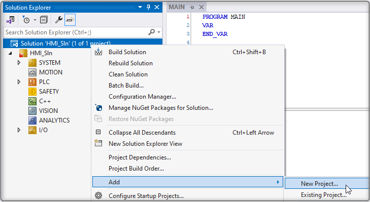

Lub może być samodzielnym projektem: 

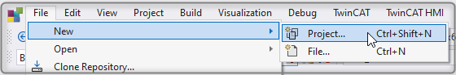

Do wyboru pojawiają się dwa główne szablony:
- TwinCAT HMI Project
- TwinCAT HMI Project Generator

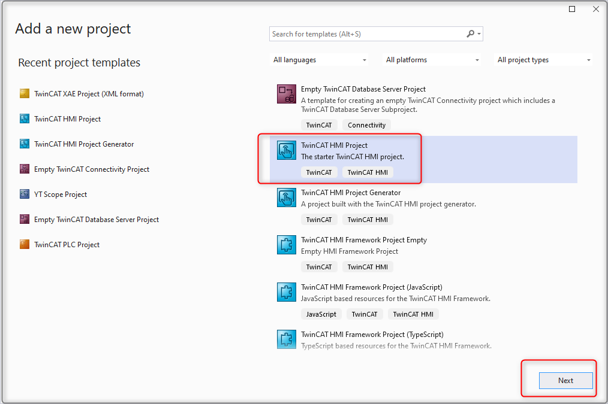

Na początek najlepiej wybrać standardowy szablon (TwinCAT HMI Project), generator jest przeznaczony dla użytkowników znających już podstawy środowiska.

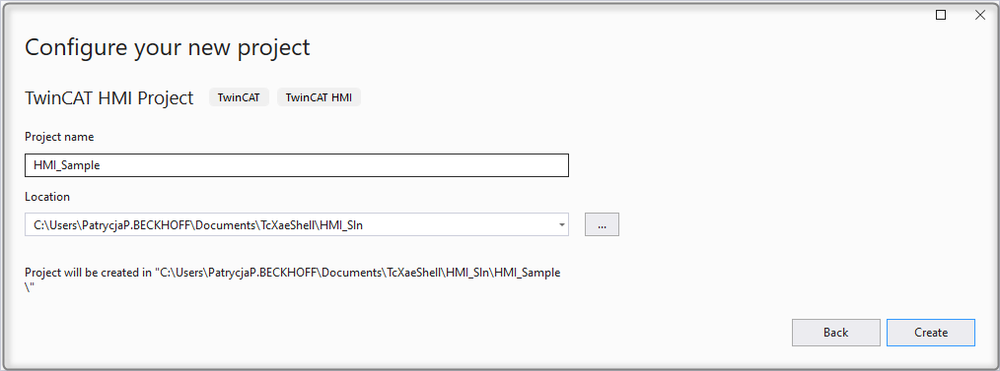

W celu poprawnego działania aplikacji nazwa projektu jak i ścieżka nie może zawierać polskich znaków, a sam projekt nie powinien znajdować się w lokalizacji sieciowej. Ścieżka dostępu nie powinna przekraczać również 255 znaków, ponieważ może to spowodować problemy w niektórych frameworkach podczas testowania aplikacji. 
<br>
Główny widok po utworzeniu projektu powinien wyglądać tak:

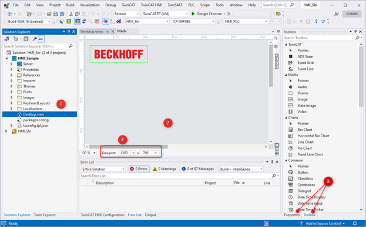

1.	Drzewko **Solution Explorer** w którym znajdują się wszystkie pliki oraz foldery wykorzystywane w projekcie. Za pomocą tej przeglądarki będziemy tworzyli nowe panele wyświetlające wizualizację, importowali pliki składowe projektu jak i konfigurowali połączenia czy też dodawali nowe rozszerzenia do solution. 
<br>
2.	Panel WYSWIG (What you see is what you get) pozwalający na dodawanie nowych elementów z paneli toolbox oraz na bieżące monitorowanie ich wyglądu. Jest to główne środowisko pracy pozwalające na zaobserwowanie jak dany panel wizualizacji będzie wyglądał na skonfigurowanej rozdzielczości ekranu opisanej na pasku **Viewport (4)**
<br>
3.	Panel **Toolbox** z listą wbudowanych kontrolek oraz panel **Properties** z konfiguracją parametrów wyświetlania oraz przekazywania danych do danego elementu HMI. W zakładce Toolbox będą też dynamicznie dodawane wszystkie nowo tworzone kontrolki użytkownika w trakcie realizacji projektu 
<br>

<div class="code-example" markdown="1" style="background: rgba(210, 243, 242, 0.8)">

INFO
{: .label .label-purple }

Jeśli Solution Explorer, zakłada Toolbox lub Propeties nie jest z jakiegoś powodu widoczna, należy wybrać View --> nazwa szukanej zakładki:
 
</div>

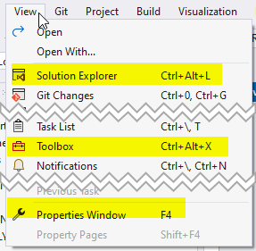

## Konfiguracja projektu 
Przed przystąpieniem do następnego etapu, utwórzmy na początek przykładową aplikację PLC i zalogujmy się z nią na dowolnym Runtimie TwinCAT’a:
<br>
```
PROGRAM P_HMI
VAR
	bStart		: BOOL;
	bSignal		: BOOL;
	tonSignal	: TON;
	sText		: STRING:='Beckhoff';
END_VAR

tonSignal(In:=bStart AND NOT tonSignal.Q, PT:=T#2S);
bSignal:=tonSignal.ET>tonSignal.PT/2;

```

<br>
Wracając do projektu TwinCAT 3 HMI spróbujmy dodać pierwsze kontrolki. Zaczynamy od umieszczenia elementów na ekranie **Desktop.view**. W klasycznym projekcie będzie występował tylko jeden element typu **.view**, który traktujemy jako ekran główny. Kolejne podstrony będziemy tworzyć jako elementy typu **.content** (zostaną one omówione później).
<br>
<br>
Na początek do otwartego pliku **Desktop.view** przeciągamy element **Toggle Button**:  

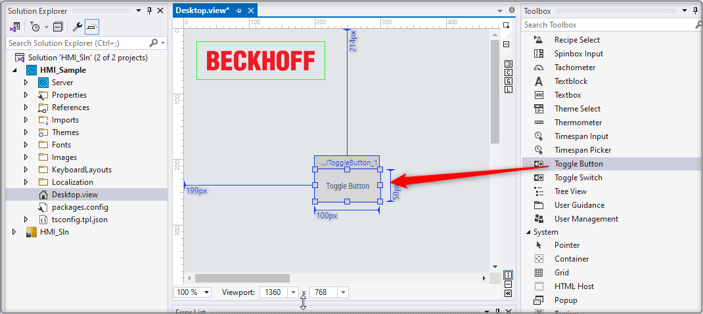

Następnie po zaznaczeniu przycisku w obszarze **Desktop.view** i wybraniu zakładki **Properties** możemy edytować jego właściwości. Wprowadźmy swój tekst:

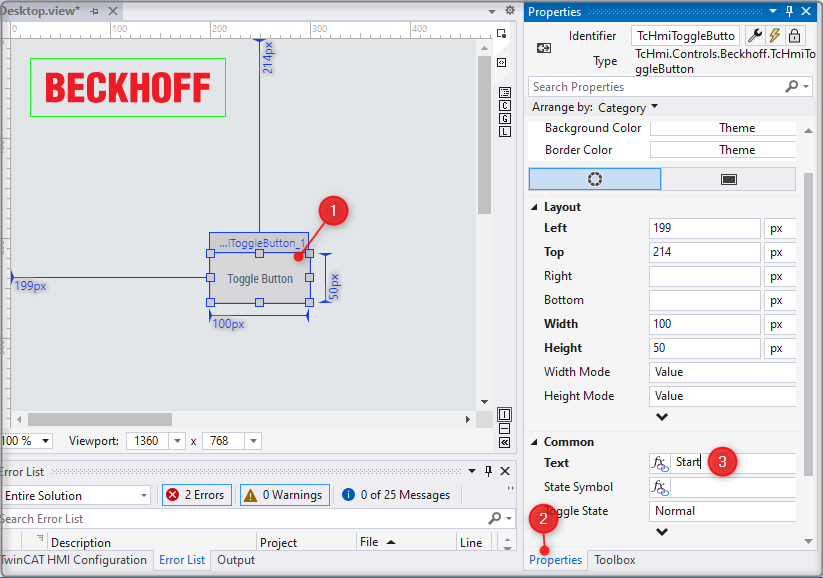

Każda kontrolka ma również we właściwościach (u samej góry) właściwość **Identifier**. Jest to unikatowy identyfikator kontrolki w obrębie projektu. Można zostawić domyślne nazwy, będą one składać się z nazwy typu kontrolki i kolejnego numeru, zalecamy jednak wpisywać swoje własne. Dla naszego przycisku wpiszmy nazwę *StartButton*:

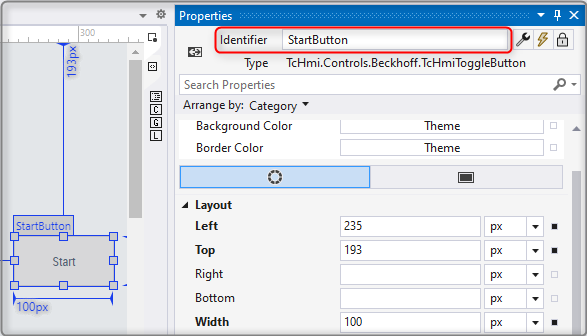

W następnym kroku do projektu dodajemy nowy element **Ellipse**:

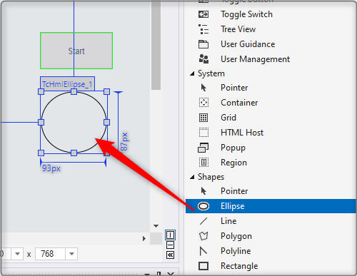

Edytujmy właściwości w ten sposób, aby szerokość i wysokość miały taką samą wartość:

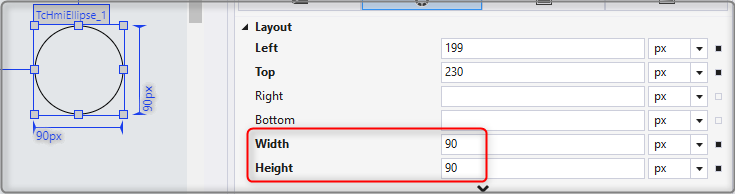

W narzędziu można również aktywować dodatkowy przybornik dla HMI, pozwalający na szybsze zarządzanie położeniem elementów na ekranie:

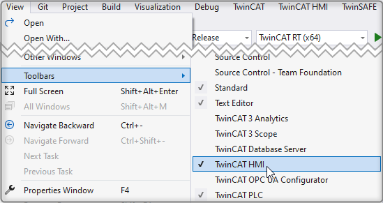
<br>
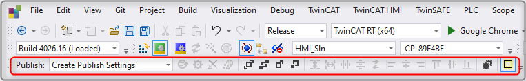

Umożliwia to np. wyrównanie elementów (po zaznaczeniu minimum dwóch obiektów):

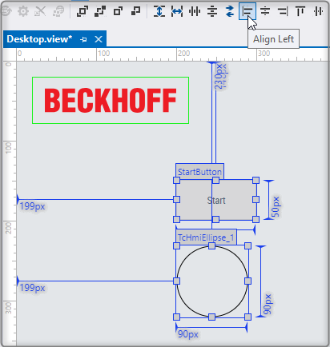

## Dodawanie zmiennych PLC
Aby zdefiniować w projekcie RunTime TwinCAT’a, z którego chcemy mieć dostęp do zmiennych, w drzewie projektu należy przejść do ustawień serwera, a następnie zakładki **ADS**:

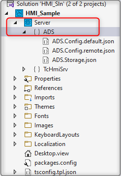

W zakładce Runtimes jesteśmy w stanie dodać połączenie do jednego bądź wielu runtimeów TwinCAT’a jednocześnie. 
<br>
<br>
Nazwa **PLC1 (1)** to symboliczna nazwa runtime, którą możemy edytować.  W polach poniżej należy przede wszystkim uzupełnić pole **AMS NetId (2)** oraz numer **portu (3)** -  domyślnie dla TwinCAT 3 port 851, a następnie zatwierdzić przyciskiem **Accept (4)**:

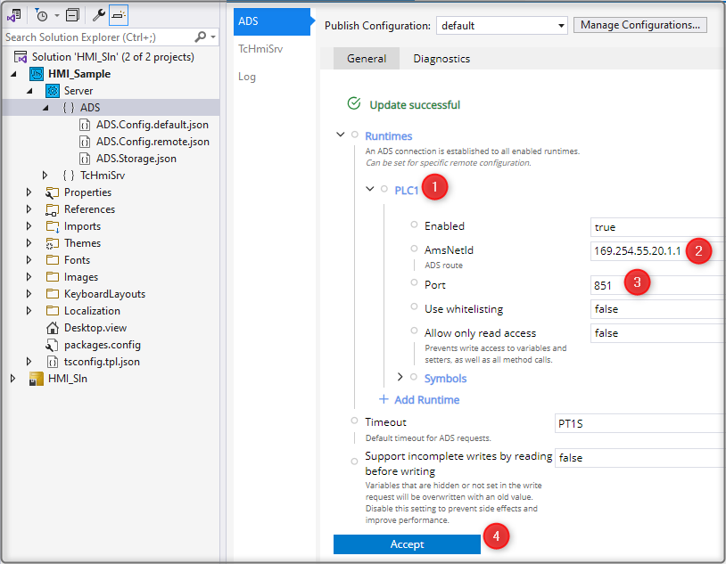

Aby sprawdzić stan połączenia należy przejść do zakładki **TwinCAT HMI Server Configuration**. W tym celu otwieramy ponownie element **Desktop.view** i klikamy ikonę z literą **C**, znajdującą się po prawej stronie:

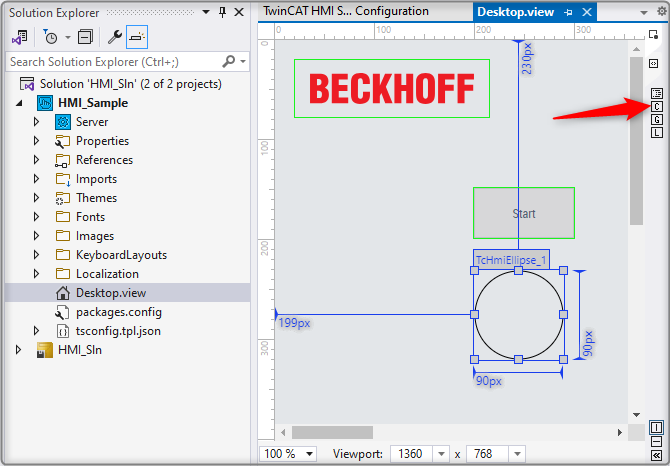

Powinno pojawić się okienko jak poniżej, gdzie w zakładce **All Symbols (1)** powinna pojawić się lista zmiennych **(2)**. Jeśli nie jest widoczna, należy wybrać ikonę **Refresh (3)**:

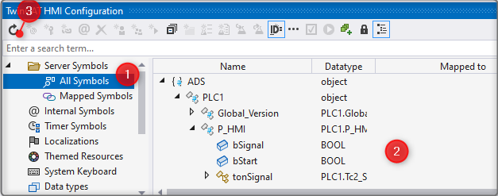

<div class="code-example" markdown="1" style="background: rgba(210, 243, 242, 0.8)">

INFO
{: .label .label-purple }

Można również pracować offline podpinająć plik TMC. Więcej informacji w [Infosys.](https://infosys.beckhoff.com/english.php?content=../content/1033/te2000_tc3_hmi_engineering/8775310603.html)
 
</div>

Ponieważ nie wszystkie zmienne z programu PLC będą używane na wizualizacji, te wybrane należy w projekcie zmapować. Można to zrobić np. klikając prawym klawiszem myszy na zmienną i wybierając opcję **Map Symbol:**

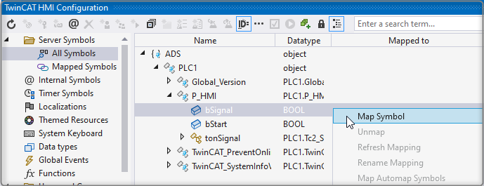

Po zmapowaniu zmienna dostanie swoją nazwę w projekcie HMI po której będzie identyfikowana. W przykładzie zostały zmapowane zmienne **bSignal** oraz **bStart**. Mapowanie można robić na różnych etapach projektu i z poziomu różnych okien, nie ma więc potrzeby mapowania wszystkich symboli wizualizacji na samym początku. 

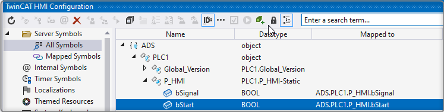

Zmienna **bStart** zostanie przypisana do przycisku, do właściwości **StateSymbol**. Robi się to poprzez opcję **Create Data Binding**, dostępną po kliknięciu w kwadracik znajdujący się na końcu wiersza:

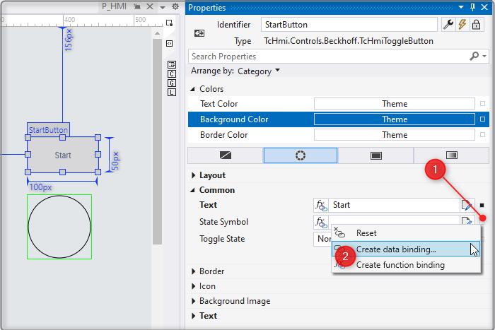

Następnie z zakładki **Mapped Symbols** wybieramy pożądaną zmienną: 

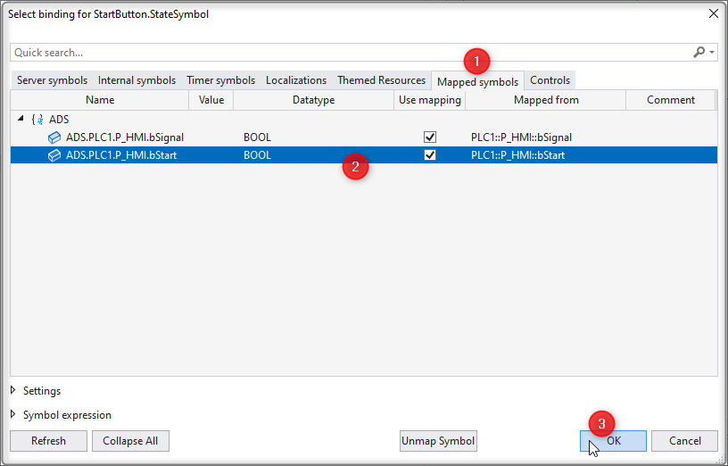

Aby przetestować czy przycisk na wizualizacji wpływa na zmienną **bStart**, należy uruchomić widok **LiveView** (ikona**L** po lewej stronie ekranu):

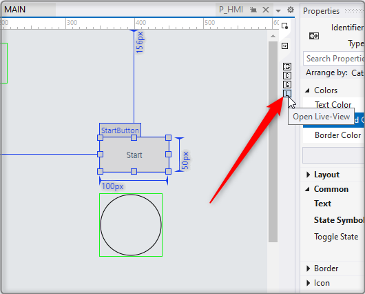

Po kliknięciu przycisku w widoku Live View, zmienna w programie PLC powinna zmienić swój stan. 

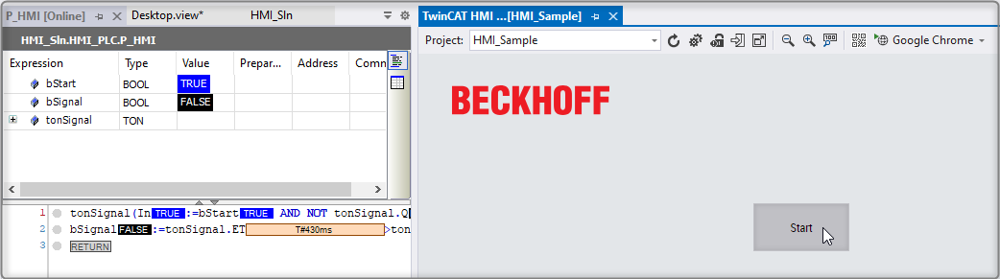

W następnym kroku skonfigurujemy element **Ellipse** w taki sposób, aby zmieniała swój kolor w zależności od stanu zmiennej **bSignal**. W tym celu zaznaczamy element Elipsy w trybie edycji, a zakładce właściwości przełączamy się do kategorii służącej do konfiguracji eventów:

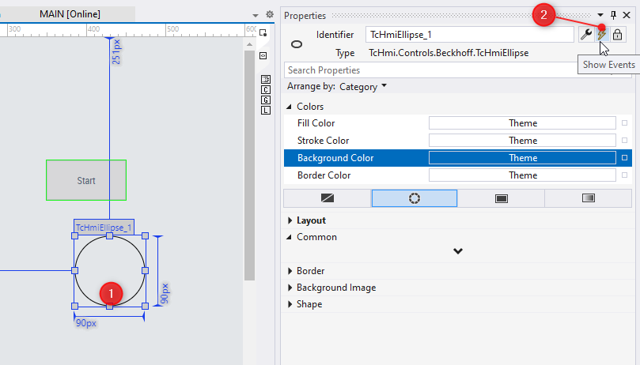

W zakładce **Events**, poza standardowymi zdarzeniami jak np. kliknięcie myszy, można stworzyć swój własny event --> **Custom**.  Będzie on wykonywany w momencie zmiany stanu/wartości zmiennej umieszczonej po lewej stronie **(A)**. Tam umieszczamy zmienną **bSignal**:

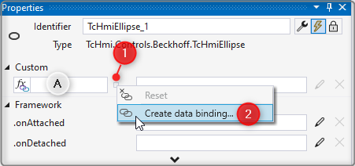
<br>
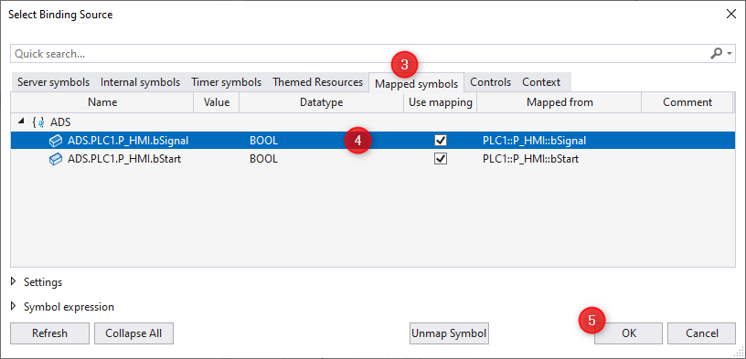

Następnie konfigurujemy dalszą logikę dla naszego eventu przyciskiem z symbolem ołówka:

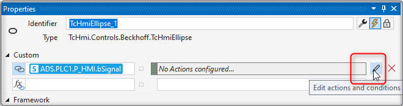

W oknie, które się pojawi przeciągamy na pole edycji eventu funkcję **Condition**:

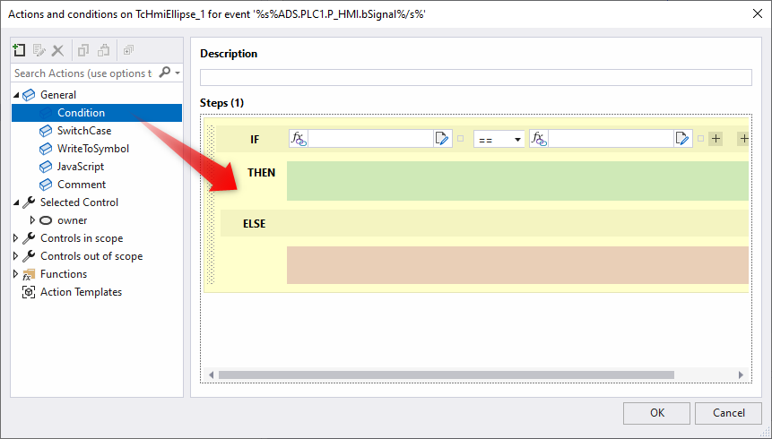

Następnie konfigurujemy warunek IF za pomocą znanej już funkcji **Create Data Binding**, podpinając zmienną **bSignal**:

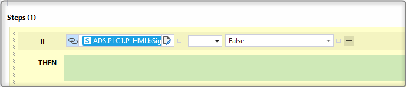

Aby skonfigurować co ma się dziać dla spełnionego (bądź nie) warunku, należy dodać funkcję **Write To Symbol**:

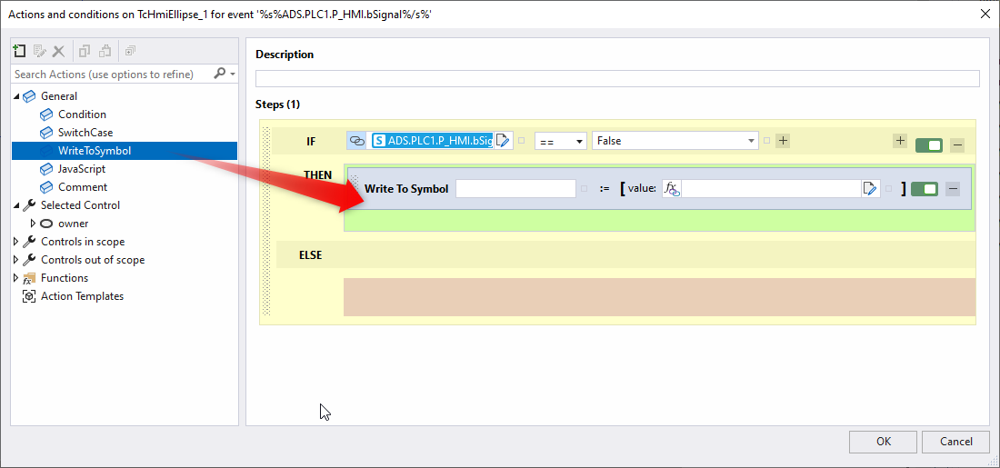

Po lewej stronie funkcji **Write To symobl**, za pomocą opcje **Create Data Binding**, umieszczamy właściwość **Fill Color** kontrolki Ellipse:

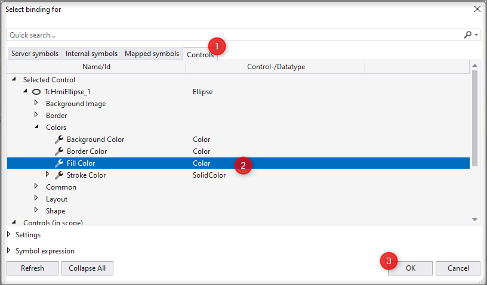

Następnie można tam przypisać pożądany kolor:

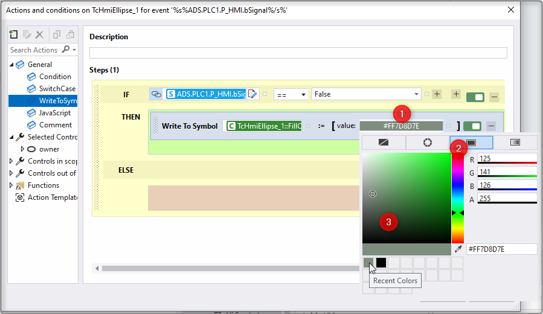

Podobną konfigurację robimy dla klauzuli ELSE:

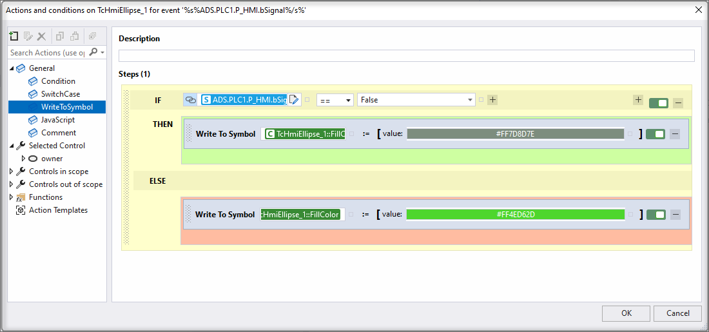

Po zatwierdzeniu zmian, uruchomieniu Live View i wciśnięciu przycisku, elipsa co sekundę powinna zmieniać swój kolor (ponieważ zmienna bSignal zmienia co sekundę swój stan w programie PLC).

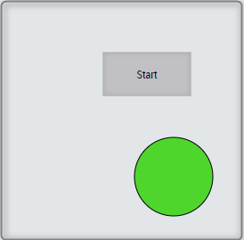

## Kierunek wymiany danych
Niektóre kontrolki, jak np. przycisk, domyślnie mają dwukierunkową wymianę danych. Większość jednak, jak np. pole tekstowe, jedynie czytają dane z programu PLC. Aby móc te dane nadpisać z poziomu wizualizacji, należy dokonać dodatkowych ustawień.
<br>
Na początek wstawmy z przybornika na ekran element **Textbox**:

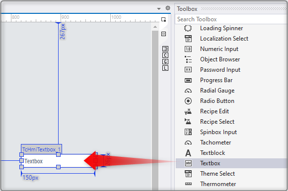

We właściwościach przypinamy zmienną do pola **Text**:

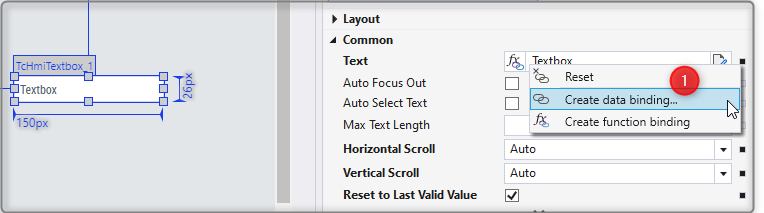
<br>
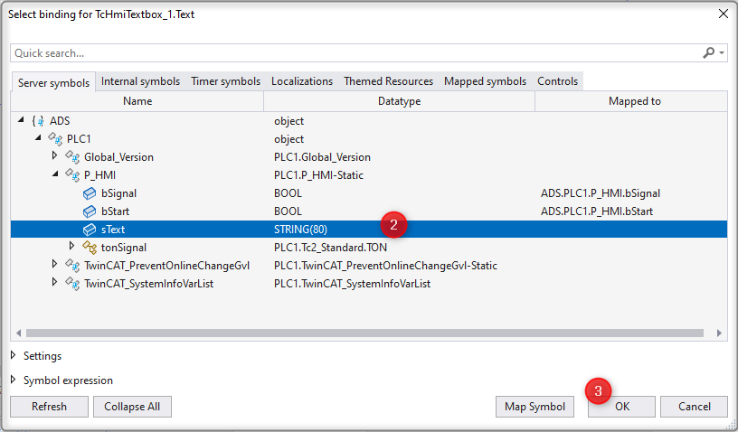

Na tym etapie wartość zmiennej powinna wyświetlać się w Live View, ale zmiany wprowadzone z poziomu wizualizacji nie będą przekazywane do PLC:

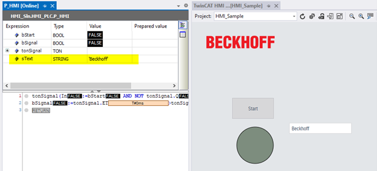

Aby móc nadpisywać wartość tej zmiennej, należy kliknąć na symbol we właściwościach kontrolki prawym klawiszem myszy i wybrać opcję **Edit symbol**:

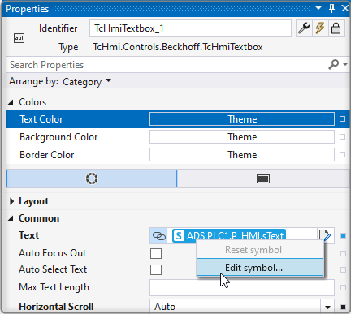

Następnie zmieniamy ustawienie **Binding Mode** na **Two Way(1)** i wybieramy moment przepisania, np. **.onUserInteractionFinished(2)**:

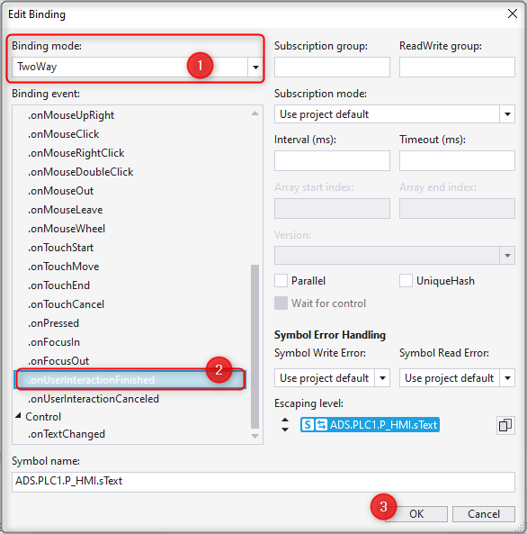

Następnie uruchamiamy Live View i testujemy dwukierunkową wymianę danych. 
<br>
Jeśli chcemy nadpisywać zmienne liczbowe z możliwością narzucenia limitów, należy wybrać kontrolkę **Numeric Input** zamiast standardowego Textbox.

# Webinar

Dowiedz się więcej z naszego kanału na YouTube:
<br>
- [o produkcie TwinCAT HMI](https://www.youtube.com/watch?v=1mu9l_HFbB0&list=PLCdWZ6-IFaTEhfNxIT1bXeWV8k4QoegVv&index=19)
- [funkcjonalności TwinCAT HMI](https://www.youtube.com/watch?v=ORhnYzzNK0Y&list=PLCdWZ6-IFaTEhfNxIT1bXeWV8k4QoegVv&index=32)
- [Audit Trail](https://www.youtube.com/watch?v=Ip4r1x140oM&list=PLCdWZ6-IFaTEhfNxIT1bXeWV8k4QoegVv&index=63)
- [seria Na Hardkodzie](https://www.youtube.com/watch?v=tTnDJP6hmQ4&list=PLCdWZ6-IFaTFZv1v4g6zxWLBZBoAe4tvL&index=3)

---
