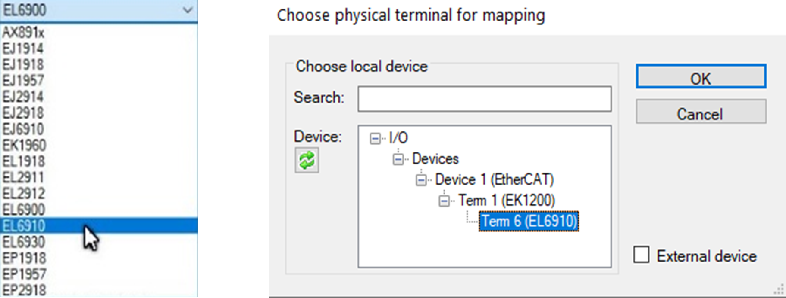
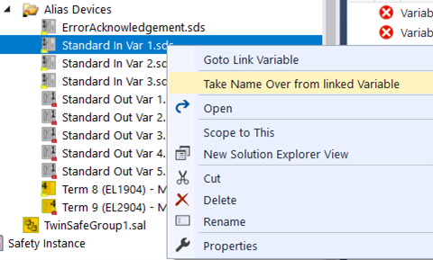

TwinSAFE EStop
{: .no_toc }
<h6> Data modyfikacji: 20.12.2024 </h6>
## Table of Contents
{: .no_toc .text-delta }

1. TOC
{:toc}

# Wstęp 
Niniejsza instrukcja przedstawia metodologię tworzenia funkcji bezpieczeństwa zatrzymania awaryjnego przy użyciu modułu bezpiecznej logiki EL6910 oraz modułów bezpiecznych wejść EL1904 i bezpiecznych wyjść EL2904.
 
Instrukcja skupia się przede wszystkim na konfiguracji projektu TwinSAFE, zastosowaniu bloku SafeEstop oraz sposobie powiązania logiki z wejściami i wyjściami (zarówno bezpiecznymi jak i PLC).
 
Blok safeEstop odpowiedzialny jest za realizację funkcji zatrzymania awaryjnego na podstawie bezpiecznych sygnałów wejściowych. 

Wejścia bloku to:
1.	Wejście restart odpowiedzialne za przywrócenie maszyny do stanu pracy.
2.	Wejścia sygnałów decydujących o bezpiecznym zatrzymaniu. W przypadku niniejszej instrukcji połączone one zostaną z przyciskiem zatrzymania awaryjnego NC+NO. Wejścia bloku funkcyjnego mogą zostać skonfigurowane do pracy z sygnałami NO i NC zarówno jedno lub dwukanałowej. W przypadku pracy dwukanałowej możliwe jest ustawienie czasu maksymalnej zwłoki synchronizacji sygnałów, co pozwala na sprawdzanie poprawności działania przycisku.
3.	Wejście EDM odpowiedzialne za monitorowanie pracy urządzenia sterowanego sygnałem EStopOut/EStopDelOut (na przykład przekaźnika) w momencie przejścia w tryb pracy/ wyjścia ze stanu bezpiecznego. Dokładny opis działania wejścia znaleźć można w dokumentacji „TwinSAFE logic FB”
4.	Parametr Delay Time określający czas zwłoki przed zmianą stanu wyjścia EStopDelOut (przydatne przy zatrzymaniu w kategorii ). Przykładem użycia może być przekazanie sygnału EStopOut PLC w celu zatrzymania procesu, zaś sygnał EStopDelOut odpowiedzialny będzie za jego awaryjne zatrzymanie po określonym, zgodnym w normami prawnymi, czasie krytycznym.
5.	Wyjścia bezpieczne.
6.	Wyjście sygnalizacji błędu załączane w przypadku przejścia bloku funkcyjnego do stanu ERROR – powodem przejścia do tego stanu może być między innymi przekroczenie czasu synchronicznego zadziałania wejść lub niezgodny ze stanem wyjścia bezpiecznego sygnał EDM w momencie przejścia bloku w tryb pracy.

# Przygotowanie sprzętowe – przykładowe stanowisko
Przed uruchomieniem sterownika sprawdzić należy ustawienie przełączników DipSwitch znajdujących się na lewej stronie każdego z modułów bezpieczeństwa. Przełączniki te odpowiedzialne są za bezpieczną adresację poszczególnych modułów, a informacje te niezbędne będą do prawidłowej konfiguracji projektu safety.
   

W przypadku występowania w aplikacji więcej niż jednego modułu tego samego modelu przełączniki te pozwalają na jednoznaczną identyfikację konfigurowanego urządzenia. Należy również upewnić się, że każdy moduł występujący w aplikacji ma unikalny adres. Adres 0 (ustawienie fabryczne) nie jest prawidłowym bezpiecznym adresem.

# Przygotowanie projektu safety pod aplikację
Pierwszym krokiem jest utworzenie nowego Solution z projektem TwinCAT XAE.

Po utworzeniu projektu i połączeniu ze sterownikiem zeskanować należy moduły rozszerzeń. Krok ten wykonać należy przed przystąpieniem do tworzenia projektu safety. 

Następnie utworzyć należy nowy Task odpowiedzialny za obsługę  urządzeń safety. W konfiguracji mastera EtherCAT należy utworzyć i przyporządkować moduły bezpieczeństwa do Sync Unitów powiązanych z bezpieczną logiką (w przykładzie Safe_Logic) oraz obsługą bezpiecznych wejść/wyjść (w przykładzie Safe_IO). Utworzone Sync Unity przyporządkować należy do utworzonego wcześniej Tasku odpowiedzialnego za safety (w przykładzie SafetyTask).
 
Czynność tą należy wykonać w stosunku do każdego z wykorzystywanych w aplikacji modułów safety (w przykładzie EL6910 odpowiedzialny za logikę oraz EL1904 i 2904 odpowiedziane za bezpieczne wejścia/wyjścia).

 
 
## Dodawanie nowego projektu Safety
Kolejnym krokiem utworzenie jest nowego projektu w zakładce SAFETY okna Solution Explorer

Następnie dodać należy nowy projekt TwinCAT Safety.

W kreatorze wpisać należy podstawowe dane projektu, takie jak Autor i Nazwa wewnętrzna projektu.

##	Konfiguracja sprzętowa urządzeń safety
Następnie należy przejść do wyboru urządzenia (Target System) z odpowiedniej zakładce Solution Explorer (1). 

W otwartym oknie wybrać należy model sterownika (2) oraz powiązać go z fizycznym urządzeniem (3), które chcemy konfigurować. W przypadku  niniejszego przykładu modułem odpowiedzialnym za logikę jest EL6910.

Zaznaczyć należy opcje widoczne po prawej stronie ekranu. Ramką zaznaczono również numer seryjny urządzenia, którego podanie wymagane będzie podczas wgrywania projektu do sterownika. Na tym etapie zweryfikować należy również adres sprzętowy dodawanego urządzenia.

Opcje zaznaczone czerwonymi strzałkami odpowiedzialne są za utworzenie w module logicznym dodatkowego Process Image (zmienne wysyłane co cykl w ramce EtherCAT) z diagnostyką połączeń. Zmienne o standardowych nazwach przyjmą wówczas nazwy z naszej aplikacji.
 
Dane te mogą (nie muszą) być używane TYLKO jako dane diagnostyczne po stronie PLC. Mamy możliwość łatwego linkowania stanów modułów, stanu jego wejść czy nawet diagnozy Safe FB (po odpowiedniej dalszej konfiguracji).
 
Kolejnym krokiem jest dodanie modułów bezpiecznych wejść (EL1904) i wyjść (EL2904) w zakładce Alias Devices. W prezentowanym przykładzie wykorzystywana jest jedna grupa, ale na potrzeby bardziej rozbudowanych aplikacji zastosować można więcej grup odpowiedzialnych na przykład za zabezpieczenie oddzielnych stref lub maszyn objętych aplikacją. Takie rozwiązanie pozwala na pracę części grup w przypadku przejścia innych w stan bezpieczny lub stan błędu. 

Jeżeli konfiguracja sprzętowa została wcześniej prawidłowo zeskanowana wystarczy zaznaczyć urządzenia, z których korzystać będziemy w projekcie.

Po powiązaniu urządzeń fizycznych otrzymamy wiadomość potwierdzającą.
 

##	Dodawanie i konfiguracja bloków funkcyjnych
W celu dodania bloku funkcyjnego przejść należy do zakładki TwinSafeGroup1.sal i przeciągnąć blok safeEstop z toolboxa do pola network 0.

W tak utworzonym bloku skonfigurować należy wejścia EStopIn – w przypadku niniejszej instrukcji przycisk EStop występuje w konfiguracji styków 1NC + 1NO. Aby przejść do okna konfiguracji najechać należy na prostokąt przy danym wejściu (w tym przypadku EStopIN2) i po kliknięciu prawym przyciskiem myszy wybrać należy opcję „Change InPort Settings”.

W oknie konfiguracji należy wybrać rodzaj zastosowanego przycisku (Two-Channel), rodzaj styku na wejściu 2 (domyślnie NC, w prezentowanym przypadku zmienić należy na NO) oraz ustawić maksymalny czas dzielący zmianę sygnałów pomiędzy dwoma kanałami przycisku na przykład na wartość 200ms. W przypadku wykrycia większej wartości zwłoki pomiędzy zmianami sygnału w trakcie aktywacji przycisku układ bezpieczeństwa uzna ten stan za błąd i przejdzie w tryb bezpieczny z sygnalizacją błędu.

## Powiązania zmiennych
Aby zapewnić prawidłowe działanie aplikacji bezpieczeństwa należy powiązać szereg zmiennych programu safety, zmiennych grupy safety, wejść/wyjść bezpieczeństwa oraz zmiennych PLC. W celu powiązania zmiennych programu safety z urządzeniami zewnętrznymi zastosować należy aliasy. 
 
 
Zmienne grupy safety odpowiedzialne są za zarządzanie poszczególnymi grupami urządzeń safety. Podgląd dostępnych portów grupowych dostępny jest w zakładce Group Ports okna Variable Mapping (szczegółowe instrukcje w dalszej części programu). Porty grupowe odpowiedzialne są między innym za ustalenie stanu pracy danej grupy safety (Stop/Run), kasowanie błędów (ErrAck) czy nadzór stanu pracy konkretnej grupy poprzez sygnalizację w przypadku wystąpienia błędów co najmniej jednego z bloków funkcyjnych danej grupy (FBErr), komunikacji (ComErr), wyjść (OutErr) oraz innych błędów (OtherErr) występujących w danej grupie. Dodatkowo port grupowy InRun odpowiedzialny jest za potwierdzenie, że dana grupa znajduje się w stanie pracy (RUN). Konfigurację projektu zacząć warto od przyporządkowania zmiennych wewnętrznych safety do portów grupowych znacznie ułatwia dalsze kroki i  pozwoli w kolejnych krokach powiązać utworzone w ten sposób zmienne ze zmiennymi PLC przy użyciu aliasów.

Zmienne PLC są zmiennymi programu PLC (w przykładzie użyto zmiennych globalnych) wykorzystywanymi do zarządzania aplikacją safety z poziomu programu PLC. Zmienne te nie są zmiennymi bezpieczeństwa i nie mogą odpowiadać za przekazywanie sygnałów bezpiecznych takich jak sygnał zezwolenia na pracę itp. Ich użycie związane jest głównie z diagnostyką grup safety oraz zarządzaniem stanem ich pracy.
 
 
Aliasy są swoistą warstwą transportową wejść i wyjść logiki safety, która pozwala na powiązanie sygnałów wewnętrznych logiki safety z sygnałami zewnętrznymi, w tym sygnałami bezpiecznymi z modułów I/O bezpieczeństwa. Każda zmienna, która nie jest zmienną wykorzystywaną jedynie w logice programu PLC musi posiadać swój alias. 
 
 
Powiązanie sygnału portu grupowego Run/Stop (wejście po stronie safety) z sygnałem PLC GVL_Safety.bRunStop (wyjście po stronie PLC) prezentuje się więc następująco (sposób tworzenia powiązań wyjaśniony w dalszych częściach instrukcji).

## Powiązanie zmiennych z portami grupowymi
W celu powiązania zmiennych grupowych ze zmiennymi safety należy w pierwszej kolejności utworzyć zmienne safety o odpowiednich nazwach. Zmienne grupowe widoczne są w zakładce GroupPorts . Porty grupowe odpowiedzialne są za zarządzanie całą konfigurowaną grupą i pozwalają między innymi na sygnalizacje i kasowanie błędów czy zmianę trybu pracy całej grupy. Każdy projekt musi mieć co najmniej 1 grupę safety.

W przypadku braku okna Variable Mapping otworzyć je można w zakładce TwinCAT View --> Other Windows --> Variable Mapping.
 
Dla zmiennych Run/Stop, FB Err, Com Err, Other Err oraz In Run utworzyć należy zmienne w programie safety. W tym celu przejść należy do zakładki „Variables” i dodać nowe zmienne naciskając znak „+”.
 
Zmiennym nadajemy dowolne nazwy, ale dla późniejszej przejrzystości projektu dobrze powiązać je nazwami ze zmiennymi Group Ports dodając przedrostek oznaczającym grupę, czyli na przykład GrP1_ (Group Ports 1).
 
Kolejnym krokiem jest powrócenie do zakładki Group Ports i powiązanie zmiennych utworzonych w poprzednim kroku z Portami Grupowymi.

Czynność tą powtarzamy dla wszystkich utworzonych zmiennych.
 
W zakładce Variables zweryfikować można nowo utworzone powiązania.

### Zmienne powiązane z blokami funkcyjnymi
W celu dodania zmiennych powiązanych z blokiem funkcyjnym zaznaczyć należy opcję dodawania nowych zmiennych (1) i nacisnąć na biały prostokąt (2) przy wejściu/wyjściu, z którym chcemy powiązać nową zmienną oraz zadeklarować jej nazwę w oknie pojawiającym się po kliknięciu. Dzięki temu utworzone zmienne zostaną automatycznie powiązane z blokiem funkcyjnym.

Utworzone zmienne zostały nazwane „RestartFBs”, „SafeEStopCh1”, „SafeEStopCh2”, „SafeEStopOutCh1” oraz „SafeError”.

### Powiązanie zmiennych z aliasami urządzeń fizycznych
Kolejnym krokiem jest powiązanie utworzonych zmiennych SafeEStopCh1, SafeEStopCh2 i SafeEStopOutCh1 z aliasami utworzonymi automatycznie w trakcie importu z konfiguracji I/O.

### Tworzenie aliasów dla zmiennych PLC
W celu powiązania programu PLC z programem układu bezpieczeństwa należy w pierwszej kolejności utworzyć listę zmiennych globalnych GVL, przy czym deklarowane wejścia GVL powiązane zostaną poprzez aliasy z wyjściami układu bezpieczeństwa, a wyjścia PLC z wejściami Safety. Zmienne te posłużą do obsługi sygnałów niezbędnych do pracy przykładowego programu bezpieczeństwa z poziomu PLC czyli diagnostyki błędów (FBErr, ComErr, OtherErr, SefeError), diagnostyki stanu grupy (InRun), kasowania błędów (ErrAck) i wyboru trybu pracy (Run/Stop). Po utworzeniu listy zmiennych należy pamiętać o przebudowaniu Solution (na tym etapie skutkuje to pojawieniem się licznych błędów safety związanych z brakiem powiązań).

W celu powiązania zmiennych globalnych z listy GVL utworzyć należy Aliasy.

Alias ErrAck tworzony jest automatycznie wraz z projektem Safety, co oznacza, że niezbędne jest utworzenie 2 wejść i 5 wyjść. Ilość ta jest bezpośrednio powiązana z ilością zmiennych globalnych, które mają wymieniać dane z programem Safety.
 
Tak utworzone aliasy (wraz z aliasem ErrorAcknowledgements) połączyć należy ze zmiennymi globalnymi z listy GVL.

Wybranie opcji „Take Name Over from linked Variable” widocznej po naciśnięciu na aliasie prawym przyciskiem myszy spowoduje automatyczną zmianę nazwy aliasu na nazwę skojarzonej z nim zmiennej globalnej.

Ostatnim krokiem jest powiązanie zmiennych z zakładki Variables projektu safety z utworzonymi aliasami.

Kompletna lista powiązań zmiennych dla tworzonego przykładu wygląda następująco:

